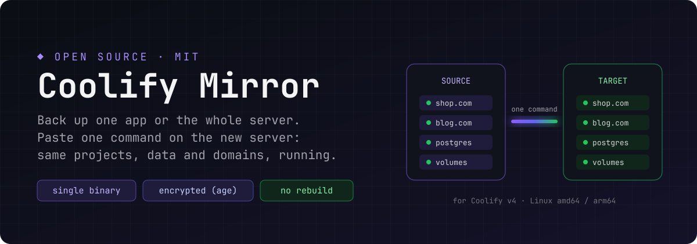
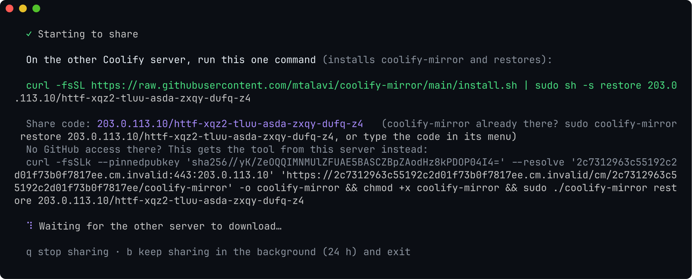
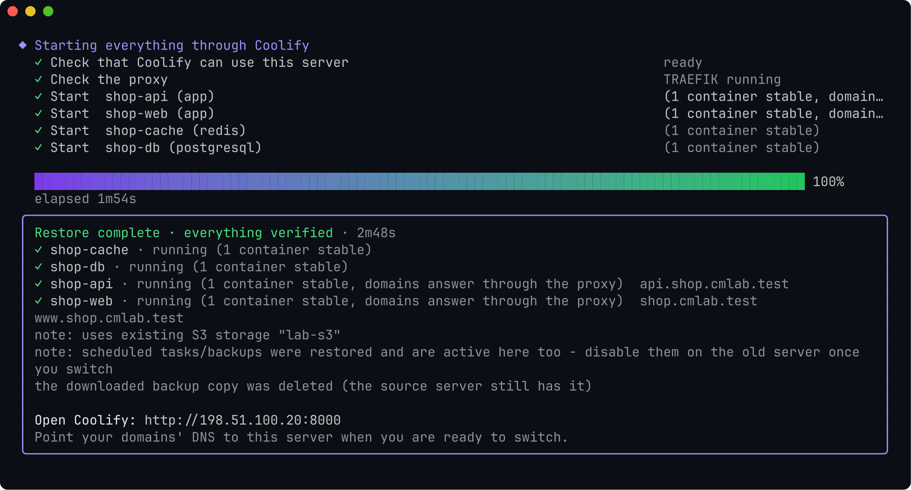
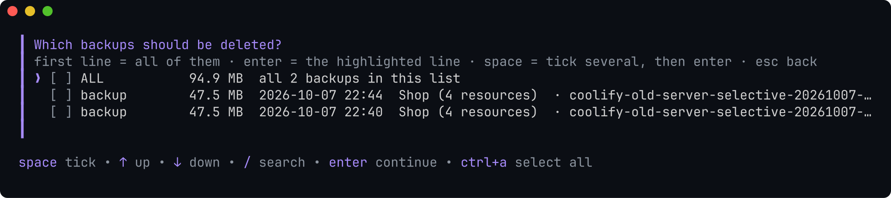

# Coolify Mirror — بک‌آپ و ریستور کامل Coolify

<p align="center">
  
</p>

یک برنامه‌ی تک‌فایلی که روی سرور Coolify اجرا می‌شود و اپ‌ها را **دقیقاً همان‌طور که روی سرور قدیم کار می‌کنند** به سرور جدید می‌برد:

- **بک‌آپ انتخابی:** پروژه‌ها را مثل داشبورد Coolify نشان می‌دهد؛ روی پروژه Enter بزنید و هر چه داخلش است (اپ‌ها، دیتابیس‌ها، سرویس‌ها، دامنه‌ها) با هم می‌آید (چند پروژه: Space روی هر کدام و بعد Enter؛ فقط یک اپ: خط آخر لیست). دیتابیسی که اپ از پروژه‌ی دیگری استفاده می‌کند خودش پیدا و اضافه می‌شود.
- **بک‌آپ کامل (Full):** کل Coolify سرور (دیتابیس Coolify، کاربران، تنظیمات، کلیدها، پروکسی و گواهی‌ها، همه‌ی volumeها و imageها).
- فایل بک‌آپ **رمزنگاری‌شده** است و با یک **کد اشتراک** از طریق HTTPS (پورت 443 خود Coolify) به سرور جدید می‌رسد.
- روی سرور جدید **یک دستور** Paste می‌کنید: نصب، دانلود، بررسی سلامت، ریستور، بالا آوردن همه‌چیز **از طریق خود Coolify** و بررسی واقعی (کانتینرها پایدار، دامنه‌ها از پروکسی جواب می‌دهند).
- در پایان، روی هر دو سرور فضای دیسک را با `Saved files & disk space` ← `All backups` ← `ALL` آزاد می‌کنید.

بعد از ریستور، در داشبورد Coolify پروژه‌ها، environmentها، env variableها، volumeها، فایل‌ها، تگ‌ها، تسک‌های زمان‌بندی‌شده و بک‌آپ‌های زمان‌بندی‌شده را **دقیقاً مثل سرور قدیم** می‌بینید.

**سایت معرفی و آموزش تصویری: [coolify-mirror.pages.dev](https://coolify-mirror.pages.dev/)**

[English README با تصویر همه‌ی صفحه‌ها](README.md) · لایسنس [MIT](LICENSE) · این پروژه رسمی Coolify نیست.

> وضعیت: نسخه‌ی 1.8.0 — با Coolify 4.3.23 واقعی (نسخه‌ی پایدار فعلی) به‌صورت کامل تست شده، از جمله انتقال به یک Coolify تازه‌نصب با همان دستورهای همین راهنما؛ جزئیات در بخش «تست‌ها». منوی برنامه انگلیسی است (ترمینال‌های SSH متن فارسی را درست نشان نمی‌دهند)؛ اسم دقیق هر گزینه در این راهنما آمده است.

---

## شروع سریع: انتقال اپ‌ها در ۴ قدم

> **پیش‌نیاز:** دو سرور با **Coolify 4.3.x و هر دو دقیقاً یک نسخه** (برنامه خودش چک می‌کند و می‌گوید کدام را آپدیت کنید) · دسترسی SSH با `root` یا کاربری که `sudo` دارد، روی هر دو · سرور جدید باید به **پورت 443 سرور قدیم** وصل شود (همان پورت پروکسی Coolify که باز است). روی سرورهای بزرگ داخل `tmux` اجرا کنید تا قطع شدن SSH کار طولانی را نیمه‌کاره نگذارد.

### ① سرور قدیم (مبدأ): گرفتن بک‌آپ

با SSH وارد سرور **قدیم** شوید و این دستور را بزنید:

```bash
curl -fsSL https://raw.githubusercontent.com/mtalavi/coolify-mirror/main/install.sh | sudo sh
```

منو باز می‌شود. در هر صفحه این کار را بکنید:

| صفحه | چه کنید |
|---|---|
| `What do you want to do?` | `Back up apps` ← Enter (برای کل سرور: `Back up the whole server`) |
| `Which project should be backed up?` | با ↑/↓ روی پروژه بروید ← Enter (هر چه داخل پروژه است با هم می‌آید) · چند پروژه: روی هر کدام Space و بعد Enter |
| `Ready to back up` | فهرست را نگاه کنید ← `Start the backup` |
| `How should the other server get this backup?` | `Share a link through Coolify's proxy on port 443` |

یک خط سبز که با `curl` شروع می‌شود نمایش داده می‌شود: **همان را کپی کنید.** آخر آن **کد اشتراک** است (مثل `203.0.113.10/hi4i-2dzx-…`). این پنجره را باز بگذارید تا سرور جدید دانلود کند (پیشرفت دانلود همین‌جا دیده می‌شود)، یا `b` بزنید تا اشتراک ۲۴ ساعت در پس‌زمینه بماند.



### ② سرور جدید (مقصد): ریستور

با SSH وارد سرور **جدید** شوید و **خطی را که کپی کردید Paste کنید و Enter بزنید**. شبیه این است:

```bash
curl -fsSL https://raw.githubusercontent.com/mtalavi/coolify-mirror/main/install.sh | sudo sh -s restore 203.0.113.10/hi4i-2dzx-hmeg-42qp-palx-52s7-zq
```

برنامه نصب می‌شود، بک‌آپ را دانلود و بررسی می‌کند. **تا وقتی `Yes` نزنید هیچ چیزی روی این سرور تغییر نمی‌کند:**

| صفحه | چه کنید |
|---|---|
| `Restore these resources into this Coolify?` | فهرست را بخوانید ← `Yes` |
| `Domains` | روی هر خط Enter یعنی همان دامنه بماند؛ یا دامنه‌ی جدید را بنویسید |
| `Rebuild N application(s) once now?` (فقط برای اپ‌هایی که Coolify خودش build می‌کند) | `Yes` ثابت می‌کند deployهای بعدی هم این‌جا کار می‌کنند · اینترنت کند: `No` (بعداً از خود Coolify) |

صبر کنید تا کادر سبز **`Restore complete · everything verified`** بیاید. Coolify جدید را باز کنید: پروژه آن‌جاست و روشن است.



### ③ جابه‌جایی

- رکورد **A** هر دامنه را در DNS به IP سرور جدید تغییر دهید.
- روی سرور قدیم اپ‌های منتقل‌شده را خاموش کنید و تسک‌های زمان‌بندی‌شده و بک‌آپ‌هایشان را غیرفعال کنید.

### ④ آزاد کردن فضای دیسک (روی هر دو سرور)

```bash
sudo coolify-mirror
```

`Saved files & disk space` ← `All backups` ← خط اول `ALL` ← Enter ← `Yes`. روی سرور جدید، وقتی مطمئن شدید همه‌چیز کار می‌کند، نسخه‌های ایمنی را هم از `Everything kept here` پاک کنید. بدون منو: `sudo coolify-mirror files delete --backups`.



**کلیدها:** ↑/↓ حرکت · Enter انتخاب/ادامه · Space تیک زدن چند خط · `/` جستجو · Esc برگشت (در منوی اصلی: خروج) · Ctrl+C توقف.

**اگر مشکلی پیش آمد:**

| پیام / وضعیت | چه کنید |
|---|---|
| نسخه‌ی Coolify دو سرور فرق دارد | Coolify قدیمی‌تر را به همان نسخه آپدیت کنید و همان دستور را دوباره بزنید |
| سرور جدید به سرور قدیم وصل نمی‌شود | پورت 443 سرور قدیم بسته است. روی سرور قدیم `q` بزنید، بعد `Share a saved backup` ← همان بک‌آپ ← `Share a link on port 8123` (برنامه پیشنهاد باز کردنش در `ufw` را می‌دهد)؛ پورت 8123 را در فایروال دیتاسنتر هم باز کنید و دستور **جدیدی** را که نشان می‌دهد روی سرور جدید بزنید |
| SSH وسط دانلود قطع شد | اشتراک سرور قدیم را باز نگه دارید و همان دستور را دوباره بزنید؛ دانلود از همان‌جا ادامه می‌دهد |
| سرور جدید به GitHub دسترسی ندارد | دستور دومی را بزنید که سرور قدیم زیر `No GitHub access there?` نشان می‌دهد |
| `Restored, but NOT operational` | علت دقیق درست بالای آن نوشته شده؛ لاگ کامل در `/data/coolify-mirror/logs/` |

تصویر همه‌ی صفحه‌ها، از شروع تا پایان، در [README انگلیسی](README.md#-walkthrough--every-screen) هست.

---

## جزئیات هر مرحله

### ۱) روی سرور مبدأ: نصب و اجرا با یک دستور

```bash
curl -fsSL https://raw.githubusercontent.com/mtalavi/coolify-mirror/main/install.sh | sudo sh
```

آخرین نسخه از GitHub نصب می‌شود (SHA-256 چک می‌شود) و منو خودش باز می‌شود. دفعه‌های بعد: `sudo coolify-mirror`. به‌روزرسانی: `sudo coolify-mirror update`.

### ۲) گرفتن بک‌آپ

منو (کلیدهای جهت‌نما + Enter):

| گزینه | کار |
|---|---|
| `Back up apps` | بک‌آپ پروژه‌های انتخابی (مثل داشبورد Coolify؛ هر چه داخل پروژه است با هم) |
| `Back up the whole server` | کل سرور Coolify |
| `Restore a backup` | ریستور با کد اشتراک (یا لینک / مسیر فایل) |
| `Share a saved backup` | اشتراک دوباره‌ی بک‌آپی که قبلاً گرفته شده |
| `Saved files & disk space` | دیدن و حذف بک‌آپ‌ها (همه با هم یا انتخابی)، دانلودها و نسخه‌های ایمنی قدیمی (پایین را ببینید) |
| `How it works` | راهنمای قدم‌به‌قدم انتقال |

**انتخاب پروژه:** لیست مثل داشبورد Coolify است: اسم پروژه، دامنه‌ی اصلی، چه چیزهایی داخلش است و روشن است یا نه. با ↑/↓ روی پروژه بروید و **Enter** بزنید؛ همه‌ی اپ‌ها، دیتابیس‌ها، سرویس‌ها و دامنه‌های آن پروژه با هم انتخاب می‌شوند. برای چند پروژه: روی هر کدام **Space** بزنید (تیک می‌خورد) و بعد Enter. `/` جستجو، `ctrl+a` همه، `esc` برگشت.

- **فقط یک اپ:** خط آخر لیست، `Pick single apps instead (advanced)`. بعد هر ریسورس جدا نشان داده می‌شود. اگر آن اپ به دیتابیسی وابسته باشد (مثلاً `DATABASE_URL` به یک Postgres اشاره کند، حتی در پروژه‌ی دیگر)، برنامه خودش پیدا می‌کند و می‌پرسد آن را هم بردارد یا نه (`Yes`).
- **صفحه‌ی `Ready to back up`:** قبل از شروع، دقیقاً نشان می‌دهد چه چیزی (پروژه به پروژه) و با چه تنظیماتی بک‌آپ گرفته می‌شود. `Start the backup` شروع می‌کند، `Change the settings` تنظیمات را عوض می‌کند و `Back to the menu` بدون هیچ کاری برمی‌گردد.
- **تنظیمات:** پیش‌فرض `Recommended` است (کانتینرها لحظه‌ای pause، imageهای اپ داخل بک‌آپ تا مقصد build نکند). برای حالت‌های دیگر `Change the settings` (جدول «ثبات داده» پایین).
- در طول کار، هر مرحله با ✓ / ✗، حجم، درصد کل، سرعت و زمان باقی‌مانده نمایش داده می‌شود.
- در پایان می‌پرسد بک‌آپ چطور به سرور دیگر برسد: **از طریق پروکسی Coolify روی پورت 443 (پیشنهادی، همیشه باز)** یا پورت مستقیم 8123.

### ۳) روی سرور مقصد: یک دستور کوتاه

سرور مبدأ بعد از بک‌آپ دقیقاً یک دستور نشان می‌دهد؛ همان را روی سرور مقصد Paste کنید:

```bash
curl -fsSL https://raw.githubusercontent.com/mtalavi/coolify-mirror/main/install.sh | sudo sh -s restore 203.0.113.10/k7qf-2m9x-pwab-cdef-ghjk-mnpq-rs
```

این دستور برنامه را روی مقصد نصب می‌کند و مستقیم ریستور را شروع می‌کند. بخش آخر (`203.0.113.10/k7qf-…`) **کد اشتراک** است: آدرس سرور مبدأ و یک رمز ۱۲۸ بیتی. همه‌چیز دیگر از همین رمز ساخته می‌شود:

- مسیر اشتراک و گواهی TLS سرور مبدأ (کلید Ed25519 از همین رمز ساخته می‌شود؛ مقصد فقط همان گواهی را قبول می‌کند، پس شنود یا جعل ممکن نیست)،
- کلید رمز بک‌آپ: سرور مبدأ آن را رمزشده با همین کد تحویل می‌دهد؛ خود کلید هیچ‌جا نوشته نمی‌شود و بعد از توقف اشتراک، کد به هیچ دردی نمی‌خورد.

اگر برنامه روی مقصد نصب است: `sudo coolify-mirror restore 203.0.113.10/k7qf-…`، یا در منو `Restore a backup` و تایپ کد.

اگر مقصد به GitHub دسترسی ندارد، سرور مبدأ یک دستور جایگزین هم نشان می‌دهد که برنامه را از خود سرور مبدأ (از همان اتصال pin‌شده) می‌گیرد و همان ریستور را اجرا می‌کند.

در صفحه‌ی اشتراک مبدأ، پیشرفت دانلود مقصد را زنده می‌بینید. کلید `b` اشتراک را ۲۴ ساعت در پس‌زمینه نگه می‌دارد (کد عوض نمی‌شود) و `q` اشتراک را متوقف می‌کند.

### ۴) ریستور روی سرور مقصد (خودکار)

دستور مرحله‌ی ۳ این مراحل را انجام می‌دهد:

1. دانلود از HTTPS با بررسی گواهی (با ادامه‌ی خودکار در صورت قطع شدن اینترنت) و **بررسی کامل سلامت** فایل (رمزنگاری + checksum) قبل از هر تغییری.
2. نمایش خلاصه: از کدام سرور، کدام نسخه‌ی Coolify، چه ریسورس‌هایی، چه حجمی.
3. **Preflight اجباری** (با `--yes` هم رد نمی‌شود): نسخه‌ی Coolify هر دو سرور باید **دقیقاً یکی** باشد؛ فضای دیسک کافی؛ اعتبارسنجی bundle رسمی Coolify با validator خود Coolify؛ تشخیص تداخل (ریسورس هم‌شناسه، volume، پوشه‌ی میزبان، دامنه)؛ آزمایش رمزنگاری با Coolify مقصد؛ اجرای آزمایشی کامل import داخل تراکنشی که rollback می‌شود.
4. تأیید شما ← بازگردانی فایل‌ها، volumeها، imageها ← بارگذاری dump دیتابیس‌ها ← اضافه شدن ریسورس‌ها به Coolify در **یک تراکنش**.
5. **دامنه‌ها (آخرین مرحله، دستی):** برای هر اپ، هر سرویس داخل docker-compose و هر بخش یک سرویس Coolify (مثلاً WordPress) یک خانه با دامنه‌ی فعلی نشان داده می‌شود. همان را نگه دارید یا دامنه‌ی جدید بنویسید. چند دامنه را با کاما جدا کنید. خانه‌ی خالی یعنی بدون دامنه. اگر `https://` ننویسید خودش اضافه می‌شود. تغییر از طریق خود Coolify ذخیره می‌شود، پس متغیرهای `SERVICE_URL_*` و `SERVICE_FQDN_*` و برچسب‌های پروکسی هم به‌روز می‌شوند. ریسورسی که دامنه‌اش هنوز روی این سرور دست ریسورس دیگری است روشن نمی‌شود.
6. روشن کردن همه‌چیز **از طریق خود Coolify** (اول دیتابیس‌ها، بعد سرویس‌ها، بعد اپ‌ها).
7. **بررسی واقعی مقصد، نه فقط «درخواست start فرستاده شد»:** هر ریسورس فقط وقتی «running» گزارش می‌شود که (۱) deployment خودش در Coolify تمام شده باشد، (۲) همه‌ی سرویس‌هایی که روی مبدأ بالا بودند روی مقصد هم ساخته شده باشند، (۳) همه‌ی کانتینرها **۳۰ ثانیه پشت سر هم** روشن و healthy باشند بدون ری‌استارت (jobهای یک‌باره مثل migration فقط با exit code صفر قبول‌اند)، و (۴) هر دامنه از مسیر Traefik محلی واقعاً به خود اپ برسد (پاسخ‌های خود پروکسی مثل `no available server`، 404 بدون route، 502 و 504 خطا حساب می‌شوند). پروکسی اگر به شبکه‌ی اپ وصل نباشد خودکار وصل می‌شود.
8. **وابستگی‌های build/runtime روی میزبان** (پایین را ببینید) دوباره بررسی می‌شوند. با `--verify-redeploy` (یا تأیید در منو) هر اپی که Coolify خودش build می‌کند یک بار روی مقصد از همان commit و بدون cache دوباره build و deploy و دوباره همین بررسی‌ها انجام می‌شود؛ یعنی deployهای بعدی هم روی سرور جدید کار می‌کنند.
9. گزارش نهایی: `SUCCESS` فقط وقتی همه‌ی موارد بالا درست باشد. در غیر این صورت «Restored, but NOT operational» با علت دقیق و exit code غیرصفر. ریسورسی که روی مبدأ خاموش بود خاموش می‌ماند و جدا اعلام می‌شود.

### ۵) آزاد کردن فضای دیسک (روی هر دو سرور)

برنامه هیچ‌چیز را خودسرانه پاک نمی‌کند؛ این‌ها روی سرور می‌مانند تا خودتان حذف کنید:

| نوع (در لیست) | کجا | چیست | کی حذف کنم |
|---|---|---|---|
| `backup` | مبدأ | بک‌آپ‌هایی که این‌جا ساخته شده (`.cmb` + کلیدش) | وقتی مقصد ریستور را تمام کرد |
| `download` | مقصد | بک‌آپ دانلودشده‌ای که ریستورش تمام نشد (بعد از ریستور موفق خودکار پاک می‌شود) | اگر دیگر نمی‌خواهید دوباره ریستور کنید |
| `unfinished` | هر دو | بک‌آپ یا دانلود نیمه‌کاره (`.part`) | هر وقت |
| `safety copy` | مقصد | `pre-restore-*`: دیتابیس و `.env` قبلی Coolify قبل از ریستور کامل؛ `replaced-*`: پوشه‌هایی که ریستور جایگزین کرد | وقتی مطمئن شدید همه‌چیز درست کار می‌کند |
| `old volume` | مقصد | volumeهای `<نام>.cm-old-<زمان>`: داده‌ی قبلی volume هم‌نام | همین‌طور |
| `logs` / `leftover` | هر دو | لاگ اجراهای قبلی، باقی‌مانده‌ی اجرای قطع‌شده | هر وقت |

**از منو:** `sudo coolify-mirror` ← `Saved files & disk space`. اول خلاصه می‌آید (هر نوع، تعداد، حجم، فضای آزاد دیسک) و بعد سؤال «What do you want to clean up?» با سه گزینه:

| گزینه | کار |
|---|---|
| `All backups` | فقط بک‌آپ‌های آماده (ساخته‌شده روی همین سرور و دانلودشده)، جدیدترین بالا. **خط اول `ALL`** = حذف همه‌ی آن‌ها یک‌جا؛ یا روی یک بک‌آپ Enter بزنید؛ یا چند تا را با Space تیک بزنید و بعد Enter |
| `Everything kept here` | همه‌چیز: بک‌آپ‌ها، فایل‌های نیمه‌کاره، نسخه‌های ایمنی، volumeهای قدیمی، لاگ‌ها |
| `Back` | برگشت به منو (یا `esc`) |

در هر لیست، کنار هر خط حجم، تاریخ و محتوا (اسم اپ‌های داخل هر بک‌آپ) و اسم فایل آمده است. قبل از حذف، فهرست موارد و اثر هر حذف نوشته می‌شود (اگر زیاد باشند ۱۰ تای اول و «… and N more») و پیش‌فرض «No» است. در پایان: «Freed X · Y free». با `ALL`، بک‌آپی که در حال استفاده است کنار گذاشته می‌شود و بقیه حذف می‌شوند. اگر بک‌آپ در زیرپوشه‌ای از `backups/` بود (`--output`)، پوشه‌ی خالی‌شده هم پاک می‌شود.

**ایمنی:** چیزی که در حال استفاده است حذف نمی‌شود: وقتی بک‌آپ یا ریستوری در جریان است، volumeی که کانتینری از آن استفاده می‌کند، بک‌آپی که در پنجره‌ی دیگری از منو در حال اشتراک است. بک‌آپی که در پس‌زمینه (`b` یا `serve`) به اشتراک گذاشته شده، با تأیید شما اول اشتراکش متوقف و بعد حذف می‌شود. فقط فایل‌های داخل `/data/coolify-mirror` و volumeهای `*.cm-old-*` خود برنامه حذف می‌شوند.

**از خط فرمان:**

```bash
sudo coolify-mirror files                          # لیست با حجم و توضیح
sudo coolify-mirror files delete NAME [NAME...]    # حذف (NAME همان ستون NAME لیست)
sudo coolify-mirror files delete --backups         # همه‌ی بک‌آپ‌ها (ساخته‌شده و دانلودشده) غیر در حال استفاده
sudo coolify-mirror files delete --all --yes       # همه‌ی موارد غیر در حال استفاده، بدون سؤال
```

شروع برنامه هم اگر برنامه فضایی گرفته باشد یک خط نشان می‌دهد: `2.9 GB kept by coolify-mirror (3 backup(s)) · 38 GB free`.

---

## فرق «بک‌آپ انتخابی» و «بک‌آپ کامل»

| | انتخابی (Back up apps) | کامل (Back up the whole server) |
|---|---|---|
| چه چیزی | ریسورس‌های انتخاب‌شده (+ وابستگی‌ها) | کل Coolify |
| مقصد | به Coolify موجودِ مقصد **اضافه (merge)** می‌شود؛ بقیه‌ی پروژه‌های مقصد دست نمی‌خورند | **فقط روی Coolify تازه و خالی** (بدون پروژه، ریسورس، سرور اضافه یا S3)؛ Coolify غیرخالی رد می‌شود و باید بک‌آپ انتخابی بگیرید |
| کاربران/تیم‌ها/تنظیمات Coolify | ✗ (مال مقصد می‌ماند) | ✓ (با کاربر و رمز سرور مبدأ وارد می‌شوید) |
| APP_KEY | رمزها با کلید مقصد **دوباره رمز** می‌شوند | کلید مبدأ روی مقصد نصب می‌شود |
| پروکسی و گواهی SSL (acme.json) | ✗ | ✓ |
| ریسورس هم‌نام/هم‌شناسه در مقصد | می‌پرسد: کپی جدا (شناسه‌ی جدید، نام با «(copy)») یا رد کردن | کانتینرهای قبلی مقصد متوقف و فقط بعد از موفقیت حذف می‌شوند |
| volume هم‌نام که از قبل در مقصد هست | داده‌ی بک‌آپ جایش می‌نشیند؛ داده‌ی قبلی در volume جدای `<نام>.cm-old-<زمان>` نگه داشته می‌شود (هیچ داده‌ای پاک نمی‌شود) | همین‌طور |
| دامنه‌ای که در مقصد دست ریسورس دیگری است | ریسورس ریستور می‌شود ولی **روشن نمی‌شود** (دو مسیریاب روی یک دامنه ترافیک را تقسیم می‌کنند)؛ دامنه را عوض و Deploy کنید | — |
| پوشه‌ی میزبان (bind mount) | اگر وجود داشته باشد محتوای فعلی کنار گذاشته می‌شود؛ در حالت «کپی» پوشه‌ی مشترکِ اصلی **هرگز بازنویسی نمی‌شود** | پوشه‌های `/data/coolify` جایگزین می‌شوند (قبلی‌ها در کپی ایمنی) |

### داخل هر بک‌آپ انتخابی

- ردیف‌های دیتابیس Coolify: خود ریسورس، settings، **همه‌ی env variableها** (معمولی و preview، multiline، literal، build-time/runtime)، persistent storageها، file storageها (با محتوا)، scheduled taskها، scheduled database backupها، زمان‌بندی بک‌آپ volume، تگ‌ها، آخرین deployment موفق، پروژه/environment، shared variableهای پروژه/environment (و team/server اگر ارجاع داده شده باشند)، S3 storage، کلید خصوصی (deploy key)، GitHub/GitLab App، شبکه‌ی داکر اختصاصی (destination).
- فایل‌ها: `/data/coolify/applications|services|databases/<uuid>` و مسیرهای bind mount تعریف‌شده در Coolify.
- volumeهای داکر با **مالکیت، دسترسی، زمان، symlink، hardlink و xattr دقیق**.
- **دیتابیس‌های PostgreSQL، MySQL و MariaDB** (مستقل یا داخل یک سرویس) با ابزار native خودشان (`pg_dumpall` و `mysqldump`/`mariadb-dump`) در حالی که روشن‌اند و بدون pause گرفته می‌شوند. در ریستور، volume داده خالی ساخته می‌شود، همان image با همان رمزها در یک کانتینر موقت (بدون شبکه) آن را مقداردهی می‌کند، dump بارگذاری می‌شود و بعد Coolify کانتینر اصلی را روشن می‌کند. دیتابیس‌های دیگر (Redis، MongoDB، ClickHouse، …) مثل قبل فایلی کپی می‌شوند.
- **bundle رسمی Server Transfer خود Coolify** (`schema_version 1`) که با کد exporter خود Coolify برای همین ریسورس‌ها ساخته می‌شود (در `coolify/server-transfer.json` داخل فایل رمزشده).
- image اپلیکیشن‌ها (پیش‌فرض) ← روی مقصد **دوباره build نمی‌شود**؛ Coolify همان image را با همان commit بالا می‌آورد. imageهای آخرین deployment موفق حتی وقتی اپ همان لحظه روی مبدأ روشن نیست هم برداشته می‌شوند. (اپ‌های Docker Compose را خود Coolify در هر deploy دوباره build می‌کند؛ برای همین وابستگی‌های build آن‌ها باید روی مقصد باشد — مورد بعدی.)
- **وابستگی‌های میزبان:** دستورهای build/start سفارشی، pre/post deployment، گزینه‌های docker run و فایل‌های دستی داخل پوشه‌ی ریسورس خوانده می‌شوند. فایل‌ها و پوشه‌هایی از میزبان که در آن‌ها آمده‌اند (مثلاً `/data/coolify/ops/build-policy.sh`، و فایل‌هایی که خود همان اسکریپت استفاده می‌کند) **داخل بک‌آپ می‌روند و روی مقصد برمی‌گردند**؛ builderهای نام‌دار `docker buildx` (`--builder X`) هم با تنظیماتشان منتقل و روی مقصد راه‌اندازی می‌شوند. فایل‌های سیستمی (`/usr`، `/etc`، …) کپی نمی‌شوند ولی قبل از ریستور روی مقصد بررسی می‌شوند و اگر نباشند ریستور شروع نمی‌شود.
- وضعیت اجرای مبدأ (کدام سرویس‌های هر ریسورس بالا بودند) تا مقصد دقیقاً با همان مقایسه شود. اگر ریسورسی روی مبدأ سالم نیست، همان موقع بک‌آپ هشدار داده می‌شود.
- لاگین رجیستری‌های داکر (`/root/.docker/config.json`) برای imageهای خصوصی (فقط رجیستری‌هایی که مقصد ندارد اضافه می‌شوند).

### داخل بک‌آپ کامل

همه‌ی موارد بالا برای کل سرور + dump کامل دیتابیس Coolify + فایل `.env` (APP_KEY) + کل `/data/coolify` (پروکسی، گواهی‌ها، کلیدهای SSH، compose فایل‌ها، تصاویر/آیکون‌ها، پوشه‌های دستی مثل `ops`) + **همه‌ی builderهای `docker buildx`** + `docker-compose.custom.yml` در صورت وجود. پوشه‌ی بک‌آپ‌های دیتابیس خود Coolify (`/data/coolify/backups`) اختیاری است.

---

## ثبات داده هنگام بک‌آپ (کانتینرهای در حال اجرا)

| گزینه | توضیح |
|---|---|
| **Pause** (پیش‌فرض) | کانتینرهایی که از یک volume یا پوشه‌ی bind‌شده استفاده می‌کنند فقط در مدت کپی همان داده فریز می‌شوند؛ یک snapshot سازگار (crash-consistent). ری‌استارت نمی‌شوند. Postgres/MySQL/MariaDB اصلاً فریز نمی‌شوند چون با dump تراکنشی گرفته می‌شوند. کانتینرهای خود Coolify (پروکسی، دیتابیس Coolify، …) هیچ‌وقت فریز نمی‌شوند. |
| **Stop** | توقف تمیز و اجرای دوباره — امن‌ترین، کمی downtime |
| **Live** | بدون وقفه — برای دیتابیس‌ها امن نیست |

---

## اگر وسط کار قطع شد

- **Ctrl+C یا قطع شدن SSH**: کار لغو می‌شود، کانتینرهای pause/stop شده فوراً ادامه می‌دهند و فایل ناقص پاک می‌شود. اگر پروسس کشته شود (مثلاً `kill -9`)، اجرای بعدی برنامه خودکار کانتینرها را برمی‌گرداند.
- **ریستور انتخابی ناموفق**: volumeها و پوشه‌های ساخته‌شده حذف و پوشه‌ها/داده‌های کنارگذاشته برگردانده می‌شوند؛ دیتابیس Coolify یا کامل تغییر می‌کند یا اصلاً تغییر نمی‌کند (یک تراکنش).
- **ریستور کامل ناموفق**: دیتابیس و `.env` قبلی از کپی ایمنی برمی‌گردند، داده‌ی volumeها و پوشه‌ها برگردانده می‌شوند، Coolify با تنظیمات قبلی دوباره ساخته می‌شود و ریسورس‌هایی که قبلاً روشن بودند دوباره روشن می‌شوند.
- فقط یک بک‌آپ/ریستور هم‌زمان روی هر سرور اجرا می‌شود (قفل).
- برای سرورهای بزرگ، برنامه را داخل `tmux` یا `screen` اجرا کنید تا قطع شدن SSH کار را لغو نکند.
- دستور کمکی: `./coolify-mirror start-all` هر ریسورسی از این سرور را که کانتینر روشنی ندارد از طریق Coolify روشن می‌کند.

---

## امنیت

- **همه‌ی اطلاعات حساس رمزگذاری‌شده است.** کل بک‌آپ یک فایل است که با [age](https://age-encryption.org) و یک passphrase تصادفی ۱۳۰ بیتی (scrypt + ChaCha20-Poly1305) رمز شده: `APP_KEY`، env variableها و secretها، API tokenها، کلیدهای خصوصی SSH، اطلاعات GitHub/GitLab App و tokenها، Access/Secret Key مربوط به S3، نام کاربری/رمز/connection string دیتابیس‌ها، webhook secretها و لاگین رجیستری‌ها هیچ‌جا بیرون از دو سرور رمزنشده وجود ندارند. هر تغییر یا ناقص بودن فایل تشخیص داده می‌شود.
- **انتقال فقط امن:** HTTPS با گواهی pin‌شده (کلید Ed25519 گواهی از رمز ۱۲۸ بیتی کد اشتراک ساخته می‌شود)؛ HTTP ساده سرو نمی‌شود و لینک‌های `http://` قدیمی رد می‌شوند. اگر گواهی سرور با pin لینک یکی نباشد (مثلاً شنود)، دانلود متوقف می‌شود. در حالت پروکسی، TLS داخل Traefik باز نمی‌شود و تا خود این برنامه می‌رسد.
- کد اشتراک خودش کلید بک‌آپ را ندارد: مقصد کلید را رمزشده با کد از اشتراک زنده می‌گیرد؛ با تمام شدن اشتراک کد بی‌اثر است. (لینک کامل قدیمی هم هنوز پذیرفته می‌شود.)
- اشتراک با `q` تمام می‌شود و در پس‌زمینه حداکثر ۲۴ ساعت می‌ماند.
- کلید هر بک‌آپ کنار آن در `*.cmb.key` با دسترسی فقط root ذخیره می‌شود تا بعداً بتوانید دوباره به اشتراک بگذارید.
- **فقط Coolify دقیقاً هم‌نسخه**، **ریستور کامل فقط روی Coolify خالی**، و **preflight + rollback اجباری** (بالا را ببینید).
- لاگ‌ها در `/data/coolify-mirror/logs` (فقط root). مقدار secretها لاگ نمی‌شوند.

---

## دستورات خط فرمان (بدون منو، برای اسکریپت)

```bash
./coolify-mirror list                                   # پروژه‌ها، ریسورس‌ها و دامنه‌ها
./coolify-mirror backup --project Shop,Blog             # کل پروژه‌ها (اسم پروژه، اسم/محیط، یا یکی از دامنه‌هایش)
./coolify-mirror backup --domain shop.com,blog.com      # ریسورس‌های تکی با این دامنه‌ها (+ وابستگی‌ها)
./coolify-mirror backup --uuid <uuid> --no-deps
./coolify-mirror backup --all                           # همه‌ی ریسورس‌های این سرور (انتخابی)
./coolify-mirror backup --full --include-backups        # کل سرور
./coolify-mirror backup --domain shop.com --serve --mode proxy
./coolify-mirror serve /data/coolify-mirror/backups/<file>.cmb --mode direct --port 8123 --open-firewall
./coolify-mirror serve <file>.cmb --detach              # ۲۴ ساعت در پس‌زمینه
./coolify-mirror restore <کد اشتراک>                     # در ترمینال: همان ریستور تعاملی منو
./coolify-mirror restore <کد یا لینک> --yes [--on-conflict copy|skip] [--team ID] [--no-start] [--keep-download]
./coolify-mirror restore '<لینک>' --yes --verify-redeploy   # بعد از بالا آمدن، یک build و deploy کامل روی مقصد برای اثبات deployهای بعدی
./coolify-mirror restore '<لینک>' --yes --set-domain shop.com=shop.new.com --set-domain www.shop.com=-   # عوض/حذف دامنه بدون سؤال
./coolify-mirror restore /path/file.cmb --key <کلید>
./coolify-mirror start-all                              # روشن کردن ریسورس‌های خاموش این سرور (اپ Compose از imageهای موجود)
./coolify-mirror update                                 # نصب آخرین نسخه‌ی برنامه (با بررسی SHA-256)
./coolify-mirror files                                  # فایل‌های ذخیره‌شده‌ی برنامه با حجم
./coolify-mirror files delete NAME... [--backups|--all] [--yes]   # حذف برای آزاد کردن فضا
```

در `restore` بدون `--yes`، دامنه‌ها در پایان یکی‌یکی پرسیده می‌شوند (Enter یعنی نگه داشتن، `-` یعنی حذف). مقدارهای `--set-domain` قبل از شروع ریستور بررسی می‌شوند.

گزینه‌های بک‌آپ: `--consistency pause|stop|live` ، `--images apps|all|none` ، `--output DIR`.
آدرس داخل کد اشتراک را می‌توانید با `--host` عوض کنید (مثلاً IP شبکه‌ی خصوصی بین دو سرور).

---

## مسیرها روی سرور

| مسیر | محتوا |
|---|---|
| `/data/coolify-mirror/backups` | فایل‌های بک‌آپ (`*.cmb`) و کلیدشان (`*.cmb.key`) |
| `/data/coolify-mirror/incoming` | دانلودهای سرور مقصد (بعد از ریستور موفق پاک می‌شوند) |
| `/data/coolify-mirror/logs` | لاگ کامل هر اجرا |
| `/data/coolify-mirror/pre-restore-<زمان>` | فقط در ریستور کامل: کپی ایمنی دیتابیس و `.env` قبلی مقصد + پوشه‌های جایگزین‌شده |
| `/data/coolify-mirror/replaced-<زمان>` | ریستور انتخابی: پوشه‌هایی از مقصد که جایگزین شدند |
| `/data/coolify-mirror/shares` | اشتراک‌های در حال اجرا (تا فایلی که به اشتراک گذاشته شده اشتباهی حذف نشود) |
| volumeهای `<نام>.cm-old-<زمان>` | داده‌ی قبلی volumeهای هم‌نام در مقصد |

همه‌ی این‌ها (به‌جز `shares`) در `Saved files & disk space` یا `coolify-mirror files` دیده و حذف می‌شوند.

---

## وقتی Coolify آپدیت می‌دهد

Coolify زیاد نسخه‌ی جدید می‌دهد و این برنامه به بخش‌هایی از داخل Coolify تکیه دارد (جدول‌های دیتابیس، کلاس‌ها و متدهای PHP). برای این‌که آپدیت Coolify هیچ‌وقت باعث خرابی بی‌صدا نشود:

1. **بررسی سازگاری قبل از هر بک‌آپ و ریستور (خودکار):** برنامه چک می‌کند همه‌ی چیزهایی که لازم دارد در همین Coolify وجود دارد: کلاس‌ها و متدها (با اجرای یک بررسی داخل خود Coolify) و جدول‌ها و ستون‌های ارجاعی دیتابیس. اگر چیزی ضروری حذف یا عوض شده باشد، **قبل از هر تغییری** متوقف می‌شود و دقیقاً می‌گوید چه چیزی کم است. اگر چیزی اختیاری عوض شده باشد، همان قابلیت به روش امن قبلی برمی‌گردد (مثلاً اپ Compose با deploy معمولی Coolify بالا می‌آید) و این را اعلام می‌کند.
2. **تشخیص تغییر ساختار دیتابیس هنگام بک‌آپ:** اگر Coolify جدولی اضافه کرده باشد که اطلاعات ریسورس‌های انتخاب‌شده را نگه می‌دارد، یا ستون ارجاعی جدیدی که این نسخه نمی‌شناسد، هشدار داده می‌شود (قبلاً بی‌صدا جا می‌ماند). ستون‌های معمولی جدید خودکار منتقل می‌شوند.
3. **تست خودکار هر نسخه‌ی جدید Coolify:** هر روز یک workflow در GitHub (`.github/workflows/compat.yml`) آخرین نسخه‌ی Coolify را روی دو سرور تازه نصب می‌کند، ریسورس واقعی (اپ Compose از git، Postgres با داده، اپ image با volume و دامنه) می‌سازد، با کد اشتراک منتقل می‌کند و داده و وضعیت را مقایسه می‌کند (`lab/e2e.sh`). نتیجه در `compat.json` روی شاخه‌ی `compat` منتشر می‌شود و اگر رد شود یک issue باز می‌شود.
4. **برنامه همین نتیجه را می‌خواند:** در شروع برنامه کنار نسخه‌ی Coolify نوشته می‌شود «tested» یا «not tested yet». نسخه‌ای که تستش رد شده با پیام روشن رد می‌شود؛ نسخه‌ای که هنوز تست نشده فقط هشدار دارد و همه‌ی حفاظ‌ها (اجرای آزمایشی import، rollback، بررسی واقعی نتیجه) سر جایشان‌اند.
5. **آپدیت خود برنامه:** اگر نسخه‌ی جدیدتری منتشر شده باشد در شروع برنامه گفته می‌شود؛ `sudo coolify-mirror update` نسخه‌ی جدید را با بررسی SHA-256 نصب می‌کند.

**نسخه‌ی دو سرور باید یکی باشد.** اگر یکی نباشد، برنامه می‌گوید کدام را به چه نسخه‌ای آپدیت کنید (همیشه سرور قدیمی‌تر را بالا ببرید؛ پایین آوردن نسخه‌ی Coolify پشتیبانی نمی‌شود). پیشنهاد: در طول جابه‌جایی «Auto Update» را در تنظیمات Coolify هر دو سرور خاموش کنید تا وسط کار یکی از آن‌ها آپدیت نشود.

---

## محدودیت‌ها و نکته‌ها

- **نسخه‌ی Coolify**: هر دو سرور باید **دقیقاً یک نسخه** داشته باشند (بخش «وقتی Coolify آپدیت می‌دهد»).
- **dump دیتابیس MySQL/MariaDB** دیتابیس‌های کاربر را دارد؛ کاربرهای دیتابیسی که دستی (جدا از `MYSQL_USER` خود image) ساخته‌اید دوباره ساخته نمی‌شوند. dump پستگرس همه‌ی roleها را دارد.
- **bundle رسمی Coolify:** importer رسمی Coolify همیشه یک رکورد سرور جدید می‌سازد و داده جابه‌جا نمی‌کند، پس ردیف‌ها با importer همین برنامه وارد می‌شوند؛ bundle رسمی برای سازگاری با فرمت Coolify، اعتبارسنجی با validator خود Coolify و نمایش هشدارهای Coolify (آدرس webhookها، credentialهایی که باید تازه شوند) استفاده می‌شود.
- **سرورهای remote**: ریسورس‌هایی که Coolify مبدأ روی سرورهای دیگر اجرا می‌کند در بک‌آپ انتخابی پشتیبانی نمی‌شوند (در لیست علامت دارند). در بک‌آپ کامل تنظیماتشان منتقل می‌شود و داده‌شان روی همان سرورها می‌ماند؛ Coolify قدیمی را خاموش کنید تا دو کنترل‌کننده نداشته باشید.
- **وابستگی‌هایی که فقط داخل مخزن git هستند:** برنامه فقط چیزی را می‌بیند که در تنظیمات Coolify یا پوشه‌ی ریسورس روی مبدأ آمده باشد. اگر اسکریپتی داخل مخزن به فایلی روی میزبان اشاره کند و کپی‌اش در پوشه‌ی ریسورس نباشد، دیده نمی‌شود؛ `--verify-redeploy` همین را با یک build واقعی روی مقصد ثابت یا رد می‌کند (و گزارش «NOT redeployable» می‌دهد).
- **فایل‌های سیستمی** (`/usr`، `/etc`، …) و builder پیش‌فرض داکر کپی نمی‌شوند؛ فقط وجودشان روی مقصد بررسی می‌شود.
- **Preview deploymentها** (PRها) و **Docker Swarm** منتقل نمی‌شوند.
- **معماری CPU متفاوت** (مثلاً amd64 ← arm64): imageها استفاده نمی‌شوند و Coolify دوباره build می‌کند.
- اپ‌های Git هنگام deploy روی مقصد باید به مخزن دسترسی داشته باشند (GitHub App / deploy key / مخزن عمومی — همه منتقل می‌شوند). **Webhookهای GitHub** همچنان به سرور قدیمی اشاره دارند؛ بعد از جابه‌جایی در GitHub به‌روز کنید.
- **تسک‌ها و بک‌آپ‌های زمان‌بندی‌شده** روی هر دو سرور فعال‌اند؛ بعد از سوییچ روی سرور قدیمی غیرفعال کنید.
- **DNS**: تا وقتی دامنه‌ها به سرور قدیمی اشاره دارند، سرور جدید برای آن‌ها گواهی SSL نمی‌گیرد (در ریستور کامل گواهی‌های قبلی منتقل می‌شوند).
- volumeهای کانتینرهای حذف‌شده‌ی قبلی مقصد پاک نمی‌شوند (`docker volume prune` با احتیاط).

---

## عیب‌یابی

| پیام | راه‌حل |
|---|---|
| `connection refused` / `timeout` هنگام دانلود | پورت 8123 در فایروال ابری بسته است ← در مبدأ «Share … through Coolify's proxy on port 443» را انتخاب کنید |
| `pin mismatch` | لینک مال یک اشتراک دیگر است یا کسی اتصال را شنود می‌کند؛ لینک تازه را از مبدأ بگیرید |
| `unencrypted http:// link` | لینک از نسخه‌ی قدیمی است؛ با همین نسخه دوباره به اشتراک بگذارید |
| `a full restore only goes onto a fresh, empty Coolify` | روی مقصد Coolify تازه نصب کنید، یا در مبدأ بک‌آپ انتخابی بگیرید (merge می‌شود) |
| `the key does not match this backup` | لینک را کامل (با `#key=...`) Paste کنید |
| `this server runs Coolify X but the backup comes from Coolify Y` | هر دو را هم‌نسخه کنید: `curl -fsSL https://cdn.coollabs.io/coolify/install.sh \| bash -s Y` |
| `Coolify cannot use this server yet` | در Coolify مقصد: Servers → localhost → Validate |
| ریسورسی بالا نیامد | لاگ deployment همان ریسورس در داشبورد Coolify + فایل لاگ در `/data/coolify-mirror/logs` |
| `Restored, but NOT operational` | جلوی هر ریسورس علت آمده: `exited (1)`، `unhealthy`، `service(s) not created`، `no available server` و …؛ همان را در Coolify درست کنید |
| `needs /path on this server` | فایلی سیستمی که اپ برای build/اجرا لازم دارد روی مقصد نیست؛ نصبش کنید و دوباره ریستور کنید |
| `NOT redeployable` | اپ روی مقصد اجرا می‌شود ولی build روی این سرور شکست خورد؛ لاگ deployment در Coolify وابستگی گمشده را نشان می‌دهد |

---

## ساختار کد (برای توسعه)

زبان Go (یک باینری static، بدون وابستگی روی سرور). رابط کاربری با [Bubble Tea](https://github.com/charmbracelet/bubbletea) و [huh](https://github.com/charmbracelet/huh).

```text
cmd/coolify-mirror      نقطه‌ی ورود: منوی تعاملی + دستورات CLI
internal/coolify        تشخیص Coolify، دسترسی به دیتابیسش (docker exec psql)، اجرای اکشن‌های خود Coolify (runner.php)
internal/lcrypt         رمزنگاری سازگار با Laravel (APP_KEY) — با بردارهای تست واقعی Laravel
internal/dbx            export ردیف‌های یک ریسورس و import با نگاشت شناسه‌ها/کلیدها و رمزنگاری دوباره
internal/archive        فرمت فایل (age + zstd + tar) و ذخیره/بازگردانی دقیق فایل‌سیستم
internal/engine         بک‌آپ، دانلود/بررسی، ریستور انتخابی و کامل، روشن‌کردن ریسورس‌ها، اشتراک، فایل‌های ذخیره‌شده (files.go)
internal/transfer       سرور HTTP با توکن و دانلودر قابل ادامه
internal/ui             صفحه‌های تعاملی
lab/                    محیط تست: دو سرور Ubuntu+systemd داخل Docker با Coolify واقعی
site/                   سایت معرفی (HTML/CSS ساده، بدون build) روی Cloudflare Pages: coolify-mirror.pages.dev
```

انتشار دوباره‌ی سایت بعد از تغییر (با حساب Cloudflare وارد شده):

```bash
npx wrangler pages deploy site --project-name coolify-mirror --branch main
```

تست‌ها (روی لینوکس/داخل Docker):

```bash
docker run --rm -v "$PWD":/src -w /src golang:1.26 go test ./...
```

### محیط آزمایشگاه (`lab/`)

`lab/Dockerfile` یک سرور Ubuntu 24.04 با systemd می‌سازد تا نصب‌کننده‌ی رسمی Coolify داخلش مثل VPS واقعی اجرا شود. نمونه‌ها: `cmlab-src` (مبدأ، داشبورد `localhost:18000`)، `cmlab-dst` (مقصد، `localhost:28000`) و `cmlab-new` (Coolify تازه، `localhost:38000`) روی شبکه‌ی داکر `cmlab`. `lab/bootstrap.php` کاربر و توکن API می‌سازد و `lab/seed_src.py` + `lab/seed_src2.py` ریسورس‌های تست را روی مبدأ می‌سازند. `lab/compose-app/` یک اپ Docker Compose چندسرویسی (Postgres + migration یک‌باره + web با healthcheck + worker) است که build آن از یک اسکریپت روی میزبان (`host/build-policy.sh` در `/data/coolify/ops`) و builder نام‌دار `cm-bounded` استفاده می‌کند، فقط با secret و دیتای volume بالا می‌آید و محتوایش (hash secret، نشانه‌ی volume، تعداد ردیف دیتابیس) را نشان می‌دهد؛ `hostbound.yaml` تست منفی است (فقط روی سرور `cmlab-src` سالم است). مخزن git آن را یک کانتینر `git http-backend` روی شبکه‌ی `cmlab` سرو می‌کند (آدرس `nip.io`، با `uploadpack.allowAnySHA1InWant` مثل GitHub) و `lab/seed_compose.py` اپ را از API می‌سازد. Coolifyهای تازه برای ریستور روی مقصد خالی: `cmlab-c2` (`localhost:52000`) و `cmlab-c3` (`localhost:53000`). اطلاعات ورود آزمایشی در `lab/.lab-credentials` است (در git نیست).

**تست سازگاری کامل با یک دستور** (هر نسخه‌ی Coolify؛ دو سرور تازه می‌سازد، منتقل می‌کند، مقایسه می‌کند و پاک می‌کند؛ با `KEEP=1` سرورها می‌مانند):

```bash
scripts/build.sh && bash lab/e2e.sh 4.3.23 dist/coolify-mirror-linux-amd64
```

نکته‌های محیط آزمایشی: نصب‌کننده را با `USER=root` اجرا کنید (وگرنه کاربر سرور localhost خالی ثبت می‌شود) و بعد از هر بوت `/run/nologin` را حذف کنید.

```bash
docker rm -f cmlab-src cmlab-dst cmlab-new          # پاک کردن محیط آزمایشی
docker volume rm cmlab-src-docker cmlab-src-containerd cmlab-src-data cmlab-dst-docker cmlab-dst-containerd cmlab-dst-data cmlab-new-docker cmlab-new-containerd cmlab-new-data
```

---

## تست‌ها (1.0.0 تا 1.8.0)

روی دو Coolify 4.3.23 واقعی:

| سناریو | نتیجه |
|---|---|
| بک‌آپ انتخابی دامنه‌ی یک اپ nginx (volume + file storage + env) با تشخیص خودکار Postgres وابسته | ✓ داده‌ی Postgres (۵۰۰۰ رکورد)، فایل‌ها با md5 یکسان، symlink و مالکیت، envها رمزگشایی‌شده در مقصد |
| اپ Git (Dockerfile) + سرویس uptime-kuma، اشتراک از پروکسی پورت 80 | ✓ روی مقصد «Build step skipped» — همان image بدون build |
| ریستور دوباره روی همان مقصد (تداخل) در حالت کپی | ✓ شناسه‌ها/volumeها/پوشه‌ها تغییر نام، `DATABASE_URL` کپی به دیتابیس کپی‌شده اشاره می‌کند |
| WordPress + MariaDB، Redis روی شبکه‌ی اختصاصی، تگ، تسک، S3 + بک‌آپ زمان‌بندی‌شده، زمان‌بندی بک‌آپ volume، حالت Stop | ✓ همه‌ی کلیدهای خارجی درست نگاشت شدند، داده‌ها سالم |
| بک‌آپ کامل ← ریستور کامل روی Coolify دیگری که ریسورس داشت | ✓ همان پروژه‌ها و داده‌ها، توکن API سرور مبدأ روی مقصد کار می‌کند، APP_KEY یکسان، کلید SSH مجاز شد |
| ریستور انتخابی روی یک Coolify **تازه نصب‌شده** (بدون ثبت‌نام و بدون Validate سرور) | ✓ سرور خودکار Validate و پروکسی روشن شد؛ اولین کاربری که ثبت‌نام کند ریسورس‌ها را می‌بیند |
| Ctrl+C وسط کپی volume در حالت Pause | ✓ کانتینرها فوراً ادامه دادند، فایل ناقص پاک شد |
| پوشه‌ی bind روی میزبان (`/srv/labdata`) | ✓ در بک‌آپ با فریز کانتینر ذخیره شد؛ در ریستور «کپی» پوشه‌ی مشترک مقصد دست نخورد |
| ریستور کپی با دامنه‌ی تکراری | ✓ ریستور شد ولی روشن نشد، با پیام «دامنه را عوض کنید» |
| خطای عمدی بعد از راه‌اندازی دوباره‌ی Coolify در ریستور کامل (failpoint) | ✓ rollback کامل: دیتابیس، `.env`، داده‌ی volumeها (رکورد نشانه‌ی مقصد سالم ماند) و همه‌ی کانتینرهای قبلی دوباره روشن |
| ریستور کامل موفق روی سروری با volumeهای هم‌نام | ✓ داده‌ی قبلی در volumeهای `*.cm-old-*` نگه داشته شد |
| خطای عمدی قبل از import در ریستور انتخابی | ✓ هیچ volume یا پوشه‌ای باقی نماند، دیتابیس دست نخورد |
| اپ Git با بک‌آپ بدون image (`--images none`) | ✓ Coolify روی مقصد از Git دوباره build کرد و بالا آمد |
| لینک منقضی، پورت بسته، کلید اشتباه | ✓ پیام خطای روشن |
| رابط تعاملی کامل (بک‌آپ انتخابی و کامل، اشتراک، حذف بک‌آپ، ریستور انتخابی با تداخل و ریستور کامل) از طریق tmux | ✓ |
| 1.2.0: dump native پستگرس (۵۰۰۰ ردیف) و MariaDB در بک‌آپ انتخابی و کامل | ✓ تعداد ردیف و checksum بعد از ریستور یکسان؛ دیتابیس‌ها pause نشدند؛ کانتینر موقت و فایل موقتی باقی نماند |
| 1.2.0: اشتراک HTTPS از پروکسی (TLS passthrough) و دانلود ابزار با `--pinnedpubkey` | ✓ با pin درست دانلود و checksum OK؛ pin اشتباه رد شد؛ HTTP ساده 404 |
| 1.2.0: ریستور کامل روی Coolify غیرخالی (حتی با `--yes`) | ✓ رد شد با پیام روشن؛ روی Coolify تازه‌نصب کامل انجام شد و ۶ ریسورس بالا آمدند |
| 1.2.0: bundle رسمی Server Transfer | ✓ با exporter خود Coolify ساخته و با validator خود Coolify روی مقصد تأیید شد؛ هشدار رسمی Coolify (S3) نمایش داده شد |
| 1.2.0: خطای عمدی بعد از بارگذاری dump | ✓ rollback کامل: تعداد volume/کانتینر/ریسورس مثل قبل، فایل موقت باقی نماند |
| 1.3.0: **migration واقعی بدون هیچ دخالت دستی** — مبدأ سالم ← بک‌آپ تازه ← Coolify تازه‌نصب ← ریستور انتخابی با `--verify-redeploy` (اپ Compose با اسکریپت build روی میزبان و builder نام‌دار، اپ Dockerfile، اپ image، سرویس WordPress+MariaDB، Postgres) | ✓ `SUCCESS`، exit 0؛ خروجی اپ از مسیر Traefik مقصد با مبدأ یکی (hash secret، نشانه‌ی volume، ۳ ردیف دیتابیس با md5 یکسان)؛ همه‌ی دامنه‌ها مثل مبدأ جواب دادند؛ اپ Dockerfile بدون build با image منتقل‌شده بالا آمد؛ rebuild کامل هر دو اپ روی مقصد از مسیر سیاست build میزبان (`BUILD_POLICY=bounded`) و builder منتقل‌شده موفق |
| 1.3.0: همان سناریو با **ریستور کامل** روی Coolify تازه‌نصب دیگر | ✓ `SUCCESS` برای ۷ ریسورس + rebuild موفق؛ داده‌ها، builder و اسکریپت میزبان مثل مبدأ |
| 1.3.0: ریستور انتخابی روی Coolify **موجود** (merge) | ✓ `SUCCESS` + rebuild موفق؛ کانتینرهای بقیه‌ی ریسورس‌های مقصد بدون تغییر |
| 1.3.0: اپی که روی مقصد بعد از start **exit می‌کند** و سرویسی که **unhealthy** می‌شود | ✓ «NOT operational: probe restarting, sick unhealthy»، exit 1 (نسخه‌ی قبل با یک نگاه لحظه‌ای ممکن بود موفق اعلام کند) |
| 1.3.0: deploy روی مقصد ناموفق (commit مبدأ در git در دسترس نبود) | ✓ «deployment failed» و exit 1، نه موفقیت |
| 1.3.0: خطای عمدی قبل از import با فایل میزبان و builder در بک‌آپ | ✓ وضعیت مقصد دقیقاً مثل قبل (دیتابیس، کانتینرها، volumeها، پوشه‌ها)، شامل پوشه‌های والدی که ریستور ساخته بود |
| 1.3.0: پاسخ واقعی Traefik وقتی پروکسی از شبکه‌ی اپ جدا است / دامنه route ندارد | ✓ 504 و 404 شناخته شدند؛ بعد از وصل دوباره 200 |
| 1.3.1: merge روی Coolify موجود که همان فایل سیاست build را دارد / همان فایل با محتوای دیگر | ✓ فایل یکسان دست نخورد و `SUCCESS` + rebuild موفق؛ فایل متفاوت ← «restore not allowed» و هیچ تغییری روی مقصد |
| 1.7.0 منتشرشده: **انتقال کامل با دستورهای همین راهنما** — نصب‌کننده‌ی رسمی روی سرور قدیم، `Back up apps` (shop-web، Postgres آن خودکار اضافه شد)، `Recommended`، اشتراک از پورت 443، Paste همان دستور روی یک Coolify 4.3.23 **تازه‌نصب** | ✓ دانلود و بررسی در ۱ ثانیه؛ ریستور تا «Restore complete · everything verified» در ۲ دقیقه و ۳۹ ثانیه؛ هر دو ریسورس پایدار و دامنه‌ها از Traefik جواب دادند؛ بعد `All backups` ← `ALL` سه بک‌آپ سرور قدیم را یک‌جا حذف کرد |
| 1.8.0 منتشرشده: **انتقال کامل یک پروژه با دستورهای همین راهنما** — نصب‌کننده‌ی رسمی روی سرور قدیم، `Back up apps` ← پروژه‌ی Shop (دو اپ، Redis، Postgres)، `Start the backup`، اشتراک از پورت 443، Paste همان دستور روی یک Coolify 4.3.23 **تازه‌نصب** | ✓ نصب‌کننده نسخه‌ی 1.8.0 را از GitHub نصب کرد؛ دانلود و بررسی ۴۷٫۵ مگابایت در ۱ ثانیه؛ «Restore complete · everything verified» در ۲ دقیقه و ۴۸ ثانیه؛ هر ۴ ریسورس پایدار و دامنه‌ها از Traefik جواب دادند (HTTP 200)؛ بعد `All backups` ← `ALL` دو بک‌آپ سرور قدیم را حذف کرد. همه‌ی اسکرین‌شات‌های README و سایت از همین اجرا است |
| 1.8.0: `Back up apps` روی مبدأ lab (۳ پروژه) ← پروژه‌ی Shop با Enter | ✓ هر ۴ ریسورس (shop-api، shop-web، shop-cache، shop-db) در `Ready to back up`؛ بک‌آپ ۴۷.۵ مگابایت در ۱۵ ثانیه |
| 1.8.0: تیک یک پروژه همراه خط `Pick single apps instead` / فقط shop-web از لیست تکی / `Change the settings` / `Back to the menu` / `Back up the whole server` | ✓ پیام «untick the projects…»؛ Postgres با سؤال وابستگی و «added: used by shop-web (DATABASE_URL)» در خلاصه؛ تنظیمات جدید در خلاصه؛ برگشت بدون بک‌آپ؛ خلاصه‌ی کل سرور (۷ ریسورس در ۳ پروژه) |
| 1.8.0: `backup --project shop.cmlab.test` / `--project Blog,"Compose Lab"` / اسم اشتباه | ✓ کل Shop (۴ ریسورس) / ۳ ریسورس / پیام «no project …» |
| 1.8.0: ریستور همان بک‌آپ Shop روی مقصد پاک‌شده (Coolify 4.3.23) | ✓ «Restore complete · everything verified»؛ هر ۴ ریسورس پایدار، دامنه‌ها از Traefik جواب دادند (HTTP 200) |
| 1.8.0: سؤال `[yes/No]` در ترمینالی که با Enter، CR و LF می‌فرستد (`files delete`) | ✓ قبل: `yes` ← «aborted»؛ حالا `yes` و `y` حذف می‌کنند و Enter خالی لغو می‌کند |
| 1.7.0: `Saved files & disk space` ← `All backups` روی مبدأ lab (۲۲ بک‌آپ، شامل زیرپوشه‌ها، یکی در حال اشتراک پس‌زمینه) | ✓ خط `ALL` + Enter ← تأیید با ۱۰ خط و «… and 11 more» و هشدار اشتراک؛ «No» ← چیزی حذف نشد؛ دو بک‌آپ تیک‌خورده با Space حذف شدند؛ `ALL` + Yes همه را حذف کرد، اشتراک متوقف و کانتینر و رکوردش پاک شد، پوشه‌های خالی‌شده هم رفتند؛ بدون بک‌آپ ← «No backups are kept on this server» |
| 1.7.0: `files delete --backups` روی مقصد lab (۵ دانلود، ۳ نسخه‌ی ایمنی) | ✓ فقط ۵ دانلود حذف شدند و نسخه‌های ایمنی ماندند؛ «n» ← چیزی حذف نشد؛ اسمی که کنارش بیاید (مثلاً یک نسخه‌ی ایمنی) هم به فهرست حذف اضافه می‌شود؛ سرور بدون بک‌آپ ← «no backups to delete here» |
| 1.6.0: منوی جدید از طریق tmux روی سرورهای lab: Enter بدون Space روی یک اپ، تنظیمات `Recommended`، بک‌آپ و اشتراک پس‌زمینه | ✓ همان اپ انتخاب و بک‌آپ شد؛ اشتراک در `shares/` ثبت شد |
| 1.6.0: `Saved files & disk space` روی مبدأ (۲۳ بک‌آپ، شامل زیرپوشه‌ها) و مقصد (۷ دانلود قدیمی، ۳ نسخه‌ی ایمنی) | ✓ حجم، تاریخ و اسم اپ‌های هر بک‌آپ درست؛ حذف تکی (Enter) و چندتایی (Space)؛ «No» ← «Nothing was deleted» |
| 1.6.0: حذف بکاپی که در پس‌زمینه به اشتراک گذاشته شده (منو و `files delete`) | ✓ اشتراک متوقف شد؛ کانتینر، گواهی و رکورد اشتراک پاک شدند؛ فضای آزادشده گزارش شد |
| 1.6.0: حذف بکاپی که در پنجره‌ی دیگری از منو به اشتراک گذاشته شده / volume در حال استفاده | ✓ رد شد با پیام «stop sharing there first» / «used by container …»؛ بعد از آزاد شدن حذف شد |
| 1.6.0: ریستور کپی (اپ تک‌کانتینری که روی مقصد هم هست) با `--on-conflict copy` | ✓ قبلاً «service(s) not created» (اشکال)، حالا `SUCCESS` و دامنه‌ی جدید از Traefik جواب داد |
| تست واحد 1.6.0: لیست فایل‌های برنامه (همه‌ی انواع، زیرپوشه، اسم اپ‌ها از manifest، اشتراک فعال، قفل در حال اجرا، لاگ همین اجرا) و ممنوعیت حذف بیرون از `/data/coolify-mirror` | ✓ |
| 1.5.0: انتقال با **کد اشتراک** (`HOST:8123/xxxx-…`) و ریستور تعاملی با `coolify-mirror restore CODE`؛ دستور جایگزین بدون GitHub (curl با گواهی Ed25519 pin‌شده) | ✓ کلید از اشتراک گرفته شد، دانلود و بررسی و ریستور `SUCCESS`؛ اپ Compose بدون build؛ کد اشتباه با خطای pin رد شد؛ «No» در سؤال آخر ← کادر «Not restored» و exit 1 |
| 1.5.0: **تست خودکار کامل** (`lab/e2e.sh`): دو سرور تازه با نصب‌کننده‌ی رسمی Coolify 4.3.23، روی مبدأ اپ Compose از git (این مخزن) + Postgres با ۱۲۳۴ ردیف + اپ nginx با volume و دامنه، بک‌آپ `--all` و اشتراک، ریستور روی مقصد فقط با کد اشتراک | ✓ `SUCCESS`، «COMPATIBLE»؛ اپ Compose بدون build؛ فایل volume و داده‌ی volume اپ Compose از مسیر Traefik مقصد، تعداد ردیف دیتابیس و secret یکسان با مبدأ |
| 1.5.0: بررسی سازگاری روی Coolify 4.3.23 | ✓ همه‌ی بخش‌های لازم پیدا شدند؛ در منو «tested with this version» |
| 1.5.0: نصب‌کننده | ✓ با ترمینال: نصب و باز شدن منو / اجرای `restore CODE`؛ بدون ترمینال: فقط نصب |
| 1.4.0: **migration واقعی Lift** (اپ Compose با ۷ سرویس، Postgres، ۶ volume، اسکریپت build میزبان) روی سرور مقصد با اینترنت کند | ✓ بدون clone و build در حدود یک دقیقه بالا آمد؛ ۶ کانتینر healthy، دامنه از Traefik مقصد 200، در Coolify `running:healthy` با شناسه‌ی درست مقصد و یک deployment ثبت‌شده (قبلاً Coolify ۱۱ دقیقه فقط clone کرد و build ساعت‌ها طول می‌کشید) |
| 1.4.0: ریستور اپ Compose در lab در حالی که **سرور git خاموش است** | ✓ `SUCCESS` — «started from the restored images, without a build»؛ بعد از آن یک deploy معمولی Coolify (clone + build) هم موفق |
| 1.3.0: ریستور بک‌آپ ساخته‌شده با 1.2.0 با نسخه‌ی جدید + تغییر دامنه با `--set-domain` | ✓ `SUCCESS`؛ دامنه‌ی جدید از Traefik جواب داد (200) |
| 1.1.0: تغییر دامنه در مرحله‌ی آخر (منو و CLI)، شامل اپ و سرویس WordPress، با ورودی نامعتبر | ✓ دامنه‌ی جدید در Coolify ذخیره شد، `SERVICE_URL_WORDPRESS` و برچسب Traefik به‌روز شدند، سایت روی دامنه‌ی جدید از پروکسی جواب داد (302)، دامنه‌ی حذف‌شده پاک شد، ورودی نامعتبر قبل از ریستور رد شد |
| باینری arm64 (شبیه‌سازی QEMU) | ✓ اجرا می‌شود |
| تست واحد: رمزنگاری Laravel، فرمت فایل و متادیتا، برنامه‌ریز import (keep/copy/skip)، دانلود قابل ادامه | ✓ |
| تست واحد 1.3.0: تشخیص وابستگی‌های میزبان و builder، پرهیز از مسیرهای runtime/سیستمی/گسترده، نصب builder و rollback آن، مانع preflight، سازگاری manifest قدیمی، انتخاب imageهای آخرین deployment، وضعیت کانتینر (healthy/unhealthy/exit/job یک‌باره/restart)، سرویس‌های ساخته‌نشده، پاسخ‌های خطای پروکسی، پورت داخلی در دامنه، دامنه‌های اپ Compose، حکم نهایی | ✓ |

---

## تغییرات

### 1.8.0 — ۲۰۲۶-۱۰-۰۸

- **انتخاب بر اساس پروژه:** `Back up apps` حالا پروژه‌ها را مثل داشبورد Coolify نشان می‌دهد: اسم، دامنه‌ی اصلی، چه چیزی داخلش است (مثلاً `2 apps, redis, postgresql`) و روشن/خاموش. با انتخاب یک پروژه هر چه داخلش است (اپ‌ها، دیتابیس‌ها، سرویس‌ها، دامنه‌ها) با هم می‌آید. پروژه‌ی چند محیطی (مثلاً production و staging) برای هر محیط یک خط دارد. پروژه‌های خالی نشان داده نمی‌شوند.
- **فقط یک اپ:** خط آخر لیست، `Pick single apps instead (advanced)`، همان لیست قبلی ریسورس‌ها را باز می‌کند. سؤال وابستگی (`Also back up what they depend on?`) مثل قبل فقط وقتی می‌آید که چیزی بیرون از انتخاب لازم باشد.
- **صفحه‌ی `Ready to back up`:** قبل از هر بک‌آپ (انتخابی یا کامل) همیشه نشان می‌دهد چه چیزی، پروژه به پروژه، با چه تنظیماتی بک‌آپ گرفته می‌شود: `Start the backup` / `Change the settings` / `Back to the menu`. صفحه‌ی جدای `Backup settings` حذف شد و جایش همین‌جاست.
- **خط فرمان:** `backup --project NAME` (اسم پروژه، `اسم/محیط` یا یکی از دامنه‌هایش؛ چند تا با کاما) کل پروژه را برمی‌دارد. `list` حالا پروژه به پروژه است (خروجی `--json` همان قبلی است).
- **رفع باگ سؤال `[yes/No]` در خط فرمان** (`files delete`، و `restore` با گزینه‌هایی مثل `--key` ولی بدون `--yes`): ترمینال‌هایی که با Enter یک line feed اضافه هم می‌فرستند، جواب را «خالی» و در نتیجه No می‌کردند (`aborted - nothing was deleted`) حتی وقتی `yes` تایپ شده بود. حالا ورودی مانده قبل از سؤال دور ریخته می‌شود.
- **ظاهر:** منوی اصلی با علامت کنار هر گزینه و توضیح کم‌رنگ، خط «This server»، علامت‌های `❯` و `[✓]`، وضعیت رنگی `● running` / `◐ 2 of 3 running` / `○ stopped` در لیست‌ها، فهرست پروژه‌به‌پروژه در صفحه‌ی ریستور (`Backup verified`) و در `Saved files & disk space` (مثلاً `Shop (4 resources)`).
- **سایت در خود برنامه:** لینک [coolify-mirror.pages.dev](https://coolify-mirror.pages.dev) در بالای منو، در `How it works` و در `coolify-mirror help`.
- پروژه‌ای که سرویسش نیمه‌روشن است (degraded) «partly running» نشان داده می‌شود، نه stopped. در ترمینال باریک (مثلاً ۴۲ ستون) ستون‌ها کم می‌شوند تا هیچ خطی نشکند.
- بعد از انتشار: همه‌ی اسکرین‌شات‌های README و سایت از یک انتقال واقعی با نسخه‌ی منتشرشده‌ی 1.8.0 (پروژه‌ی Shop) از نو گرفته شدند.

### 1.7.1 — ۲۰۲۶-۱۰-۰۷

- **سایت معرفی و آموزش:** [coolify-mirror.pages.dev](https://coolify-mirror.pages.dev): آموزش ۴ مرحله‌ای با اسکرین‌شات‌های واقعی هر صفحه، چیزهایی که منتقل می‌شود، نمونه‌های واقعی، پشت صحنه، تاریخچه‌ی نسخه‌ها و پرسش‌ها. سورس در پوشه‌ی `site/`.
- صفحه‌ی اشتراک (منو و `serve`) در حالت پورت 443: به‌جای IP داخلی پروکسی Traefik (مثلاً `10.0.1.9`) نوشته می‌شود `The other server`؛ پشت پروکسی IP واقعی سرور مقصد دیده نمی‌شود.
- «شروع سریع» در هر دو README: کجا چه دستوری بزنید و در هر صفحه چه انتخاب کنید، به‌علاوه‌ی جدول عیب‌یابی.
- همه‌ی تصاویر README با نسخه‌ی منتشرشده‌ی 1.7.0 از نو گرفته شدند: انتقال واقعی به یک Coolify 4.3.23 تازه‌نصب، از نصب تا آزاد کردن فضا.
- بعد از انتشار (فقط مستندات): متن بنر از «یک لینک» به «یک دستور» تغییر کرد. `SECURITY.md` هم که هنوز از «HTTP ساده» حرف می‌زد، با رفتار واقعی هماهنگ شد: اشتراک فقط HTTPS، کد اشتراک ۱۲۸ بیتی که کلید بک‌آپ در آن نیست، فایل `.key` فقط برای root، و پایان خودکار اشتراک پس‌زمینه بعد از ۲۴ ساعت.

### 1.7.0 — ۲۰۲۶-۱۰-۰۶

- **`All backups` در صفحه‌ی `Saved files & disk space`:** اول می‌پرسد چه چیزی پاک شود: `All backups` (فقط بک‌آپ‌های آماده، ساخته‌شده یا دانلودشده) یا `Everything kept here` (لیست کامل قبلی). در لیست بک‌آپ‌ها خط اول `ALL` همه را یک‌جا حذف می‌کند؛ حذف تکی (Enter) و چندتایی (Space) مثل قبل. بک‌آپ در حال استفاده با `ALL` کنار گذاشته می‌شود.
- خط فرمان: `coolify-mirror files delete --backups` (همه‌ی بک‌آپ‌های غیر در حال استفاده؛ با `--yes` بدون سؤال).
- صفحه‌ی تأیید حذف حداکثر ۱۰ خط نشان می‌دهد («… and N more»)، تا سؤال و Yes/No همیشه روی صفحه باشند؛ ستون حجم مرتب شد.
- علامت «⇄ shared now» / «[in use]» قبل از اسم فایل آمد تا در صفحه‌ی باریک بریده نشود.
- حذف بک‌آپی که در زیرپوشه‌ی `backups/` بود (`--output`) پوشه‌ی خالی‌شده را هم پاک می‌کند.
- راهنمای `How it works` (قدم ۴) دو گزینه‌ی جدید را توضیح می‌دهد.

### 1.6.0 — ۲۰۲۶-۱۰-۰۶

- **آزاد کردن فضای دیسک روی هر دو سرور:** گزینه‌ی منوی `Saved files & disk space` و دستور `coolify-mirror files` همه‌ی چیزهایی را که برنامه روی سرور نگه داشته با حجم و توضیح نشان می‌دهند: بک‌آپ‌ها (با اسم اپ‌های داخلشان، شامل زیرپوشه‌های `--output`)، دانلودهای ریستورهای ناتمام، فایل‌های نیمه‌کاره، نسخه‌های ایمنی ریستور (`pre-restore-*`، `replaced-*`)، volumeهای `*.cm-old-*`، لاگ‌ها و باقی‌مانده‌ها. حذف تکی یا چندتایی با تأیید (پیش‌فرض No) و توضیح اثر هر حذف. چیزی که در حال استفاده است حذف نمی‌شود؛ بکاپ در حال اشتراک پس‌زمینه اول اشتراکش متوقف می‌شود. شروع برنامه یک خط درباره‌ی فضای گرفته‌شده نشان می‌دهد. اشتراک‌های فعال در `/data/coolify-mirror/shares` ثبت می‌شوند.
- **انتخاب ساده‌تر:** در لیست اپ‌ها Enter همان خط انتخاب‌شده را برمی‌دارد (قبلاً بدون Space چیزی انتخاب نمی‌شد)؛ Space فقط برای انتخاب چند اپ.
- **تنظیمات بک‌آپ در یک قدم:** `Recommended` یا `Choose them myself`.
- **منوی اصلی مرتب‌تر** با توضیح هر گزینه، و گزینه‌ی `How it works` (راهنمای قدم‌به‌قدم: مبدأ، مقصد، سوییچ DNS، آزاد کردن فضا). «Share or delete» به `Share a saved backup` تبدیل شد و حذف به صفحه‌ی فایل‌ها رفت.
- راهنمایی در جاهای لازم: بعد از بک‌آپ، بعد از دانلود کامل در صفحه‌ی اشتراک، و در یادداشت‌های ریستور (نسخه‌ی ایمنی و volumeهای قدیمی کجا حذف می‌شوند).
- **رفع اشکال:** ریستور یک اپ تک‌کانتینری به‌صورت کپی (وقتی همان اپ روی مقصد هست) با وجود کانتینر سالم «service(s) not created» می‌داد، چون منتظر اسم کانتینر با شناسه‌ی مبدأ بود.
- پروسس اشتراک پس‌زمینه بعد از پایان به‌صورت zombie نمی‌ماند.

### 1.5.0 — ۲۰۲۶-۱۰-۰۶

- **دو دستور کوتاه به‌جای لینک و دستور طولانی.** مبدأ: `curl … install.sh | sudo sh` نصب می‌کند و منو را باز می‌کند. مقصد: سرور مبدأ بعد از بک‌آپ یک دستور نشان می‌دهد (`… | sudo sh -s restore 203.0.113.10/xxxx-xxxx-…`) که نصب می‌کند و ریستور را شروع می‌کند. **کد اشتراک** (آدرس + رمز ۱۲۸ بیتی) جای لینک بلند (توکن + کلید + pin) را می‌گیرد: توکن و کلید Ed25519 گواهی TLS از همان رمز ساخته می‌شوند و کلید بک‌آپ رمزشده با کد از اشتراک گرفته می‌شود. `coolify-mirror restore CODE` در ترمینال همان ریستور تعاملی منو است. دستور جایگزین بدون GitHub هم کوتاه‌تر شد و مستقیم ریستور را اجرا می‌کند. نصب‌کننده خطاهای موقت GitHub (مثل HTTP 500) را چند بار دوباره امتحان می‌کند.
- **مقاوم در برابر آپدیت‌های Coolify:** بررسی خودکار همه‌ی بخش‌های لازم Coolify (کلاس/متد PHP و جدول/ستون دیتابیس) قبل از هر بک‌آپ و ریستور؛ کم بودن بخش ضروری ← توقف قبل از هر تغییر با پیام دقیق؛ بخش اختیاری ← بازگشت قابلیت به روش امن. تشخیص جدول‌ها و ستون‌های ارجاعی جدید Coolify هنگام بک‌آپ (قبلاً بی‌صدا جا می‌ماند). تست روزانه‌ی خودکار هر نسخه‌ی جدید Coolify در GitHub (`compat.yml` + `lab/e2e.sh`) و خواندن نتیجه‌ی آن در خود برنامه (`tested` / `not tested yet` / رد). پیام عدم تطابق نسخه حالا می‌گوید کدام سرور را به چه نسخه‌ای بالا ببرید.
- **`coolify-mirror update`** و اعلام نسخه‌ی جدید در شروع برنامه.
- سؤال rebuild بعد از ریستور می‌گوید که دانلود دارد (روی اینترنت کند بهتر است No).

### 1.4.0 — ۲۰۲۶-۱۰-۰۶

- **اپ‌های Docker Compose بدون clone و build بالا می‌آیند.** Coolify اپ Compose را در هر deploy از git clone و build می‌کند، حتی وقتی imageهای همان commit روی سرور هست؛ روی سروری با اینترنت کند همین ساعت‌ها طول می‌کشید. حالا اگر imageهای سرویس‌هایی که روی مبدأ بالا بودند منتقل شده باشند، `docker-compose.yaml` و `.env` را خود Coolify برای این سرور می‌سازد (شناسه‌ها، دامنه‌ها، env درست) و همان دستور start خود Coolify (یا start سفارشی اپ) با `--no-build` فقط برای همان سرویس‌ها اجرا می‌شود؛ یک deployment «finished» در تاریخچه‌ی Coolify ثبت می‌شود. اگر imageی نباشد یا start شکست بخورد، مثل قبل Coolify deploy می‌کند و علتش در گزارش می‌آید. `start-all` هم همین را برای اپ‌های Compose انجام می‌دهد.
- **لغو ریستور واضح گزارش می‌شود.** «No» یا Esc در سؤال آخر قبلاً فقط «(back to the menu)» کم‌رنگ نشان می‌داد و شبیه پایان کار بود؛ حالا کادر «Not restored — Nothing was changed on this server» می‌آید.
- پیشرفت ریستور: volume دیتابیسی که از dump پر می‌شود و فایل میزبانی که یکسان است و نگه داشته می‌شود دیگر «در حال انجام» نمی‌مانند.
- ظاهر: لوگوی رنگی با انیمیشن کوتاه (فقط در ترمینال تعاملی)، نسخه، معرفی، قابلیت‌ها و آدرس ریپو در شروع برنامه.

### 1.3.1 — ۲۰۲۶-۱۰-۰۶

برچسب `v1.3.0` روی GitHub اشتباهی روی commit ناقصی (بدون تغییرات زیر) ساخته شد و چون Releaseها و برچسب‌ها غیرقابل تغییرند، نسخه‌ی درست **1.3.1** است؛ از `v1.3.0` استفاده نکنید.

- در ریستور انتخابی، فایل میزبانی که روی مقصد **با همان محتوا** هست دست نمی‌خورد و فایلی که **با محتوای دیگر** هست جایگزین نمی‌شود: ریستور قبل از هر تغییری متوقف می‌شود (ممکن است ریسورس‌های دیگر مقصد از آن استفاده کنند). فایل نبود ← برگردانده می‌شود. اثرانگشت SHA-256 هر فایل میزبان داخل بک‌آپ است. ریستور کامل (روی Coolify خالی) همه را برمی‌گرداند.
- تشخیص سخت‌کدشده‌ی یک اسکریپت خاص حذف شد؛ همه‌ی موارد با تشخیص عمومی پیدا می‌شوند. بک‌آپ‌هایی که `host_requirements` دارند همچنان بررسی می‌شوند.

### 1.3.0 (منتشرنشده؛ در 1.3.1)

قرارداد اصلی: ریسورس مقصد بعد از ریستور باید از نظر اجرایی معادل مبدأ باشد و `SUCCESS` فقط با بررسی وضعیت واقعی مقصد چاپ شود. دو migration واقعی نشان دادند این تضمین نمی‌شد.

- **وابستگی‌های build/runtime روی میزبان منتقل و بررسی می‌شوند** (ریشه‌ی شکست deploy بعد از ریستور): فایل‌هایی از میزبان که دستورهای سفارشی Coolify یا فایل‌های پوشه‌ی ریسورس به آن‌ها اشاره می‌کنند، و builderهای نام‌دار `docker buildx` (`--builder`) داخل بک‌آپ می‌روند و برمی‌گردند؛ فایل‌های سیستمی قبل از ریستور روی مقصد بررسی می‌شوند؛ بعد از ریستور همه دوباره بررسی و builderها راه‌اندازی می‌شوند. بک‌آپ کامل همه‌ی builderها را هم می‌برد.
- **SUCCESS فقط با وضعیت واقعی** (ریشه‌ی «موفق» اعلام شدن ریسورس Exited/Unhealthy): ثبات ۳۰ ثانیه‌ای همه‌ی کانتینرها بدون ری‌استارت، همان سرویس‌هایی که روی مبدأ بالا بودند، job یک‌باره فقط با exit 0، و درخواست واقعی به هر دامنه از مسیر Traefik محلی. هر مشکل ← «Restored, but NOT operational» با علت و exit code غیرصفر. ریسورس نگه‌داشته‌شده به‌خاطر تداخل دامنه هم موفقیت حساب نمی‌شود؛ ریسورسی که روی مبدأ خاموش بود جدا اعلام می‌شود.
- **`--verify-redeploy`** (و سؤال در منو): rebuild کامل روی مقصد از همان commit و بدون cache، برای اثبات این‌که deployهای بعدی بدون سرور قدیمی کار می‌کنند.
- imageهای آخرین deployment موفق حتی وقتی اپ روی مبدأ خاموش است برداشته می‌شوند؛ بک‌آپ درباره‌ی ریسورس خاموش یا ناسالم مبدأ هشدار می‌دهد. وضعیت «running» مبدأ از کانتینرهای واقعی هم گرفته می‌شود، نه فقط ستون status خود Coolify.
- اتصال پروکسی به شبکه‌ی اپ (که قبلاً فقط برای سرویس‌ها بود) برای همه‌ی ریسورس‌های دارای برچسب Traefik انجام می‌شود.
- رفع: تغییر دامنه‌ی اپ غیر Compose در مرحله‌ی دامنه‌ها، برچسب‌های Traefik را به‌روز نمی‌کرد و دامنه‌ی قدیمی route می‌شد (حالا مثل UI خود Coolify دوباره ساخته می‌شوند).
- رفع: دامنه‌ی خودکار `sslip.io` که Coolify هنگام ساخت اپ Compose می‌گذارد (و هرگز route نمی‌شود) جزو دامنه‌های اپ حساب می‌شد.
- رفع: rollback پوشه‌های والدی را که ریستور ساخته بود (مثلاً `/data/coolify/ops`) باقی می‌گذاشت.
- بک‌آپ‌های نسخه‌های قبل همچنان ریستور می‌شوند.

### 1.2.0 — ۲۰۲۶-۱۰-۰۵

- **انتقال فقط HTTPS:** گواهی self-signed تازه برای هر اشتراک و pin کلید عمومی داخل لینک (`#key=…&pin=…`)؛ دانلودکننده فقط همان کلید را قبول می‌کند. حالت پروکسی حالا روی پورت 443 با TLS passthrough (مسیریابی SNI) کار می‌کند؛ HTTP ساده دیگر سرو نمی‌شود و لینک‌های `http://` رد می‌شوند. دستور یک‌خطی دانلود ابزار با `curl --pinnedpubkey`.
- **dump native دیتابیس‌ها:** PostgreSQL با `pg_dumpall` و MySQL/MariaDB با `mysqldump`/`mariadb-dump` بدون pause؛ ریستور با همان image در کانتینر موقت بدون شبکه.
- **فقط Coolify دقیقاً هم‌نسخه** برای هر نوع ریستور.
- **ریستور کامل فقط روی Coolify خالی**؛ برای Coolify موجود فقط ریستور انتخابی (merge).
- **Preflight اجباری** (نسخه، فضای دیسک، bundle، تداخل‌ها، اجرای آزمایشی) هم موقع برنامه‌ریزی و هم دوباره درست قبل از نوشتن؛ `--yes` آن را رد نمی‌کند. کمبود فضا حالا مانع است، نه هشدار.
- **هماهنگی با Server Transfer رسمی Coolify 4.3.23:** bundle رسمی (`schema_version 1`) با کد exporter خود Coolify ساخته و داخل بک‌آپ گذاشته می‌شود، روی مقصد با `ServerTransferBundle::validate` بررسی و با ریسورس‌های بک‌آپ تطبیق داده می‌شود، و هشدارهای Coolify نمایش داده می‌شوند.

### 1.1.0 — ۲۰۲۶-۱۰-۰۴

- **مرحله‌ی دامنه در پایان ریستور:** قبل از روشن شدن ریسورس‌ها، همه‌ی دامنه‌ها (اپ، سرویس‌های compose و بخش‌های سرویس‌های Coolify) پرسیده و از طریق خود Coolify ذخیره می‌شوند. اگر تداخل دامنه با این کار برطرف شود، ریسورس روشن می‌شود.
- CLI: گزینه‌ی `--set-domain OLD=NEW` (قابل تکرار، `-` برای حذف). بدون `--yes` دامنه‌ها پرسیده می‌شوند.
- اگر ذخیره‌ی دامنه‌ها خطا بدهد، ریستور از دست نمی‌رود: فقط هشدار داده می‌شود و ریسورسی که دامنه‌اش تداخل دارد خاموش می‌ماند.
- انتشار متن‌باز با لایسنس MIT در `github.com/mtalavi/coolify-mirror`، نصب‌کننده‌ی یک‌خطی `install.sh` (تشخیص amd64/arm64 و بررسی SHA-256)، ساخت خودکار Release با GitHub Actions، README انگلیسی گرافیکی با اسکرین‌شات واقعی؛ این راهنمای فارسی به `README.fa.md` منتقل شد.
- رفع یک مشکل: گاهی دستور `docker network connect` که Coolify بعد از روشن کردن سرویس اجرا می‌کند بی‌صدا شکست می‌خورد و دامنه خطای 504 می‌داد. حالا برنامه بعد از سالم شدن سرویس، اتصال پروکسی به شبکه‌ی آن را دوباره انجام می‌دهد.

### 1.0.0 — ۲۰۲۶-۱۰-۰۱

- نسخه‌ی اول: بک‌آپ انتخابی و کامل، اشتراک با لینک (پورت مستقیم یا پروکسی Coolify)، ریستور انتخابی (با حالت کپی/رد برای تداخل‌ها) و کامل (با کپی ایمنی و rollback)، روشن کردن ریسورس‌ها از طریق Coolify بدون build دوباره، منوی تعاملی و دستورات CLI.
- سخت‌سازی بعد از بازبینی کد: volume هم‌نام در مقصد دیگر پاک نمی‌شود (داده‌ی قبلی در `*.cm-old-*`)؛ rollback کامل ریستور Full (دیتابیس، `.env`، راه‌اندازی دوباره‌ی Coolify و روشن کردن کانتینرهای قبلی)؛ قفل سراسری و بازیابی امن کانتینرهای pause‌شده؛ مدیریت SIGHUP (قطع SSH)؛ فریز کانتینرها هنگام کپی پوشه‌های bind؛ ممنوعیت مسیرهای حساس و والدهایشان (`/data`، `/root`، `~/.ssh`، …)؛ عدم بازنویسی پوشه‌ی مشترک در ریستور کپی؛ روشن نکردن ریسورس با دامنه‌ی تکراری؛ تراکنش صریح SQL؛ چک‌سام برنامه در دستور دانلود؛ رمز Redis از stdin؛ پشتیبانی volumeهای NFS/bind به‌صورت «فقط تعریف»؛ دستور `start-all`.
