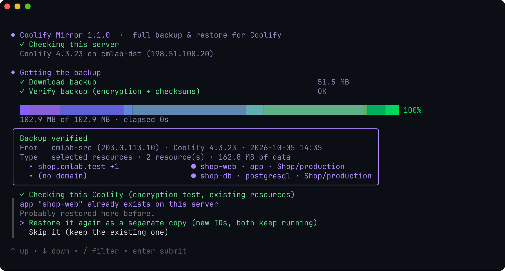
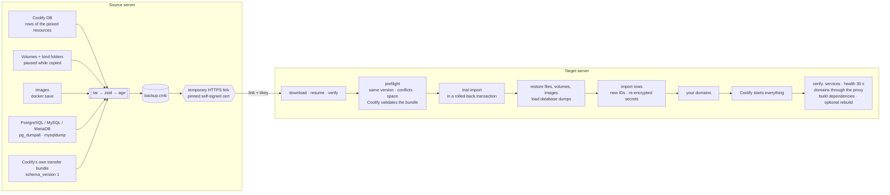

<p align="center">
  
</p>

<p align="center">
  <a href="https://github.com/mtalavi/coolify-mirror/releases/latest"></a>
  <a href="https://github.com/mtalavi/coolify-mirror/actions/workflows/ci.yml"></a>
  
  
  
  <a href="LICENSE"></a>
</p>

<p align="center">
  <b>Back up one domain, a few, or a whole Coolify server — then restore it on another Coolify with a single pasted link.</b><br>
  Projects, environments, env vars, secrets, volumes, files, images and proxy settings arrive intact and start through Coolify itself.
</p>

<p align="center">
  <a href="#-install">Install</a> ·
  <a href="#-walkthrough">Walkthrough</a> ·
  <a href="#-how-it-works">How it works</a> ·
  <a href="#-command-line">CLI</a> ·
  <a href="#-safety">Safety</a> ·
  <a href="#-limitations">Limitations</a> ·
  <a href="README.fa.md">فارسی</a>
</p>

---

## ✨ Why

Coolify's own backup covers its database. Moving **one app** to a new server — with its database data, volumes, env vars, domains and the exact built image — is a manual afternoon. Coolify Mirror makes it one menu:

| | |
|---|---|
| 🎯 **Pick by domain** | Arrow keys + enter (space to tick several). Databases and services an app depends on (via `DATABASE_URL`, etc.) are found and added for you. |
| 🔒 **Encrypted at rest and in transit** | The whole backup — `APP_KEY`, env vars, SSH keys, tokens, S3 keys, database passwords — is one [age](https://age-encryption.org)-encrypted file (passphrase, scrypt). It travels over **HTTPS with a pinned certificate**; the key and the pin live only in the link's `#fragment`. |
| 🔗 **One link transfer** | A temporary, random-token HTTPS link — through Coolify's own proxy on port 443 (TLS passthrough), or a direct port. Plain HTTP is never served. |
| 🗄️ **Native database dumps** | PostgreSQL, MySQL and MariaDB are saved with `pg_dumpall` / `mysqldump` while they keep running, and loaded with the same image on the target. |
| 🧾 **Coolify's own format inside** | Every backup also carries Coolify's official *Server Transfer* bundle (`schema_version 1`, made by Coolify's exporter) and the target validates it with Coolify's own validator. |
| ⚡ **No rebuild** | The exact images your app runs are shipped. Dockerfile apps: Coolify logs *“Build step skipped”*. Docker Compose apps: started from those images without cloning or building (Coolify would rebuild them on every deploy). |
| 🧰 **Host dependencies travel too** | Files on the host that custom build/start commands or helper files use (a build policy script under `/data/coolify/ops`, …) and named `docker buildx` builders are carried and restored; system files are checked on the target before anything changes. A selective restore keeps an identical file already on the target and never replaces a different one (it stops before changing anything). |
| ✅ **SUCCESS means it really works** | A resource counts as running only when the services that ran on the source are up, stay healthy for 30 s without restarting, and each domain answers through the local Traefik. `--verify-redeploy` also rebuilds every app once on the target to prove later deploys work. |
| 🌐 **Domains last** | Right before anything starts you can keep or change every domain. |
| ♻️ **Preflight + rollback** | Exact-version check, conflict and domain detection, disk space, bundle validation and a trial import in a rolled-back transaction run **before** anything changes; a failure in the middle puts the target back the way it was. |

---

## 🚀 Install

Two commands in total. **On the source server**, this installs the tool and opens it:

```bash
curl -fsSL https://raw.githubusercontent.com/mtalavi/coolify-mirror/main/install.sh | sudo sh
```

After the backup it prints **one command for the target server** — paste it there, it installs the tool and restores:

```bash
curl -fsSL https://raw.githubusercontent.com/mtalavi/coolify-mirror/main/install.sh | sudo sh -s restore 203.0.113.10/k7qf-2m9x-pwab-cdef-ghjk-mnpq-rs
```

The last part is the **share code**: the source address and a 128-bit secret. The share token, the TLS key of the share (Ed25519 — the target accepts only that certificate) and the key that unlocks the backup's own key are all derived from it, so nothing else has to be copied. Once sharing stops, the code is useless.

The installer picks `amd64`/`arm64`, downloads the [latest release](https://github.com/mtalavi/coolify-mirror/releases/latest), verifies its SHA-256 and installs `/usr/local/bin/coolify-mirror` (it retries GitHub hiccups). Pin a version with `… | sudo VERSION=v1.5.0 sh`, only install with `NO_RUN=1`. Later: `sudo coolify-mirror`, and `sudo coolify-mirror update` for a new release.

> [!TIP]
> A target without GitHub access: the source also prints a command that downloads the tool **from the source server itself** over the same pinned connection and restores.

<details>
<summary><b>Build from source</b></summary>

```bash
git clone https://github.com/mtalavi/coolify-mirror && cd coolify-mirror
scripts/build.sh            # → dist/coolify-mirror-linux-{amd64,arm64} + SHA256SUMS
scp dist/coolify-mirror-linux-amd64 root@SERVER:/usr/local/bin/coolify-mirror
```
Needs Go 1.26+. The binaries are static (no CGO) and have no runtime dependencies besides Docker and Coolify on the server.
</details>

---

## 🎬 Walkthrough

Real screenshots from two Coolify 4.3.23 servers (IP addresses replaced with documentation ranges).

### On the source server

**1 · Start** — the tool checks Docker, Coolify and its version, and says how much disk space its saved files use. *How it works* shows the whole move step by step.


<details>
<summary>The built-in guide</summary>


</details>

**2 · Pick what to move** — every resource with its domain, type, project and state. Move to an app and press `enter` — that's it. Several apps: `space` on each, then `enter`. `/` filters, `ctrl+a` selects all.


**3 · Dependencies** — the Postgres that `shop-web` uses through `DATABASE_URL` is suggested automatically.


**4 · Options** — *Recommended* is one keypress (pause for a moment, include application images). *Choose them myself* asks how to keep running databases consistent while their data is copied, and which Docker images to include.


| Consistency | What happens |
|---|---|
| **Pause** *(default)* | Containers using a volume are paused for the seconds it takes to copy it. Databases are dumped live and never paused. |
| **Stop** | Stopped and started again — safest, a short downtime. |
| **Live** | Nothing is touched; databases may be copied mid-write. |

| Images | What happens on the new server |
|---|---|
| **Application images** *(default)* | Apps built by Coolify start from the shipped image — no rebuild. Public images (postgres, wordpress…) are pulled. |
| **All images** | Everything is in the file — works without internet / Docker Hub. Bigger file. |
| **No images** | Smallest file; Coolify pulls everything and **rebuilds** apps from Git. |

**5 · Live progress** — every step with ✓ / ✗, bytes, speed and ETA.


**6 · Share** — one command for the other server appears (it installs the tool and restores the **share code** at its end), plus the bare code and a fallback that needs no GitHub.


### On the target server

**7 · Run the command** — or choose *Restore a backup* in the menu and type the code.


**8 · Verify** — the file is downloaded (resumable), decrypted and every checksum verified **before** anything changes.



**9 · Review** — conflicts, existing volumes, shared host folders and domain clashes are listed. Nothing has changed yet.


**10 · Domains, last** — keep or change every domain. Comma-separate several; empty removes it.


**11 · Running** — Coolify itself starts databases, then services, then apps. The tool then checks the real state: the same services as on the source, all containers healthy for 30 s without restarts, and every domain answering through the proxy. Anything else ends as *Restored, but NOT operational* with the reason and a non-zero exit code.


Refresh Coolify — the project is there with all its environments, variables, storages, tags, scheduled tasks and backups.

### Afterwards · free the disk space (both servers)

Nothing is deleted behind your back, so the menu's **Saved files & disk space** (or `coolify-mirror files`) shows everything the tool keeps on a server, with size, date and contents — and deletes what you pick:


| Kind | Where | What | Delete it when |
|---|---|---|---|
| `backup` | source | backups made here (`.cmb` + key) — the apps inside are named | the target has restored it |
| `download` | target | a downloaded backup whose restore did not finish (removed automatically after a successful one) | you won't restore it again |
| `unfinished` | both | interrupted backups / downloads (`.part`) | any time |
| `safety copy` | target | `pre-restore-*` (previous Coolify database + `.env`), `replaced-*` (folders a restore replaced) | everything works |
| `old volume` | target | `<name>.cm-old-<time>` — previous data of a volume that already existed | everything works |
| `logs`, `leftover` | both | logs of earlier runs, remains of interrupted runs | any time |

`enter` deletes the highlighted line, `space` ticks several. Every deletion says what is lost and needs a *Yes* (default *No*). Anything in use is protected: while a backup/restore runs, a volume a container uses, a backup shared from another menu window. A backup shared in the background is unshared first. Only the tool's own folder and its own `*.cm-old-*` volumes are ever touched.

---

## 🧠 How it works



**Selective backup** (one or more resources) exports their rows from Coolify's Postgres — application, service, database, environment variables, storages, tags, scheduled tasks, backup schedules, S3, keys, GitHub App, deployment snapshot — plus their volumes, file mounts and images. On restore, every row gets a fresh ID, every encrypted value (env vars, passwords, keys) is decrypted with the source key and re-encrypted with the target's `APP_KEY`, and the import runs in **one transaction**.

**Full backup** takes the whole Coolify: database dump, `.env` (including `APP_KEY`), SSH keys, proxy config and certificates, and every resource's data. A full restore is only allowed onto a **fresh, empty** Coolify; it still makes a safety copy and rolls back on any error. To move resources into a Coolify that already has projects, use a selective backup — it merges.

**Databases.** PostgreSQL, MySQL and MariaDB containers (standalone or inside a service) are saved with their native dump tool while they run. On restore their data volume is created empty, initialised by the same image with the same credentials in a temporary container (no network), the dump is loaded, and only then does Coolify start the real container. Other engines (Redis, MongoDB, ClickHouse…) are copied as files with the chosen consistency mode.

**Coolify's official format.** Coolify 4.3.23 ships an (internal) *Server Transfer* exporter/importer. It moves the Coolify records of a remote server between instances, but no data, and refuses the Coolify host itself. Every backup embeds that official bundle, produced by Coolify's own exporter code for the selected resources, and the target checks it with Coolify's `ServerTransferBundle::validate` and shows Coolify's own warnings (webhook URLs, credentials to refresh). The rows themselves are imported by this tool, because the official importer always creates a new server record instead of using the target's localhost.

| | Selective | Full |
|---|---|---|
| Use it for | moving / cloning projects | moving a whole server |
| Target Coolify | any — merges, existing resources are kept | **fresh and empty only** |
| Logins | target's users | source's users, API tokens, settings |
| Same resource already there | restore as copy, or skip | — |

---

## ⌨️ Command line

Everything in the menu also works headless, for scripts:

```bash
coolify-mirror list                                     # resources and domains
coolify-mirror backup --domain shop.com,blog.com        # selective (+ dependencies)
coolify-mirror backup --all                             # every resource
coolify-mirror backup --full                            # the whole Coolify
coolify-mirror backup --domain shop.com --serve --mode proxy
coolify-mirror serve FILE.cmb --detach                  # share for 24 h in the background
coolify-mirror restore 203.0.113.10/k7qf-2m9x-…       # share code (in a terminal: the menu's restore)
coolify-mirror restore 203.0.113.10/k7qf-2m9x-… --yes # no questions
coolify-mirror restore FILE.cmb --key KEY --yes \
  --set-domain shop.com=shop.new.com --set-domain www.shop.com=-
coolify-mirror start-all                                # start anything stopped (compose apps from their images)
coolify-mirror update                                   # install the latest release (SHA-256 checked)
coolify-mirror files                                    # what the tool keeps here, with sizes
coolify-mirror files delete NAME… | --all [--yes]       # free the disk space
```

<details>
<summary><b>All flags</b></summary>

| Command | Flag | Meaning |
|---|---|---|
| `backup` | `--domain a,b` / `--uuid u` / `--all` / `--full` | what to back up |
| | `--no-deps` | don't add databases/services the apps depend on |
| | `--consistency pause\|stop\|live` | see the table above |
| | `--images apps\|all\|none` | see the table above |
| | `--include-backups` | full: also `/data/coolify/backups` |
| | `--output DIR` | default `/data/coolify-mirror/backups` |
| | `--serve --mode proxy\|direct --port 8123 --host IP --open-firewall` | share right after (HTTPS; proxy = port 443) |
| `serve` | `--key`, `--mode`, `--port`, `--host`, `--open-firewall`, `--detach`, `--ttl 24h` | share an existing file |
| `restore` | `CODE` / link / file | a share code `HOST[:PORT]/xxxx-…`, a full link, or a `.cmb` file |
| | `--key KEY` | for a file (or a link without `#key=`) |
| | `--yes` | no questions |
| | `--on-conflict copy\|skip` | resource already exists here |
| | `--team ID` | target team (selective) |
| | `--set-domain OLD=NEW` | change a domain; `NEW` = `-` removes it (repeatable) |
| | `--no-start` | restore but don't start |
| | `--verify-redeploy` | after starting, rebuild every app Coolify builds (same commit, no cache) and check it again |
| | `--keep-download` | keep the downloaded file |
| `files` | `delete NAME…` / `--all` / `--yes` | list, or delete, saved backups, downloads, safety copies, old volumes, logs |
</details>

---

## 🛡️ Safety

- **Everything sensitive is encrypted.** The backup is a single age-encrypted file (random 130-bit passphrase, scrypt): `APP_KEY`, environment variables and secrets, API tokens, private SSH keys, GitHub/GitLab app credentials, S3 access/secret keys, database users, passwords and connection strings, webhook secrets and registry logins never exist unencrypted outside the two servers. The key is written only to `<file>.key` (mode 600) and the link's `#fragment`.
- **No plain HTTP.** Shares are HTTPS only. The certificate's Ed25519 key is derived from the share code's 128-bit secret, so the downloader accepts exactly that public key (a mismatch aborts). Through Coolify's proxy the TLS connection is passed through untouched (SNI routing), so it ends in this tool, not in Traefik. The code does not contain the backup key: the target fetches it, encrypted with the code, from the running share. Sharing stops when you quit (or after `--ttl`, 24 h max in the background).
- **Same Coolify version only.** Restores require exactly the same Coolify version on both servers; the message says which server to upgrade to which version.
- **Coolify updates are checked, not trusted.** See below.
- **Full restore only onto an empty Coolify.** A target with projects, resources, extra servers or S3 storages is refused — use a selective (merge) restore.
- **Mandatory preflight.** Version, disk space, Coolify's bundle validation, conflicts (same resources, volumes, host folders, domains) and a trial import in a rolled-back transaction run before anything is written. `--yes` only skips the confirmation, never these checks.
- **Verified result.** `SUCCESS` is printed only when every restored resource runs like on the source and its domains answer through the proxy; build dependencies on the host are checked too. A resource held back by a domain clash or failing any check makes the restore end with *NOT operational* and exit code 1.
- **Rollback.** Selective: everything created is removed if the import fails (including parent folders it created). Full: the previous Coolify database and `.env` are restored and its containers started again.
- **Nothing is deleted.** Volumes that already exist on the target keep their old data in `<name>.cm-old-<time>`; replaced folders go to `/data/coolify-mirror/replaced-<time>`. They stay until you delete them in *Saved files & disk space*.
- **One run at a time.** A lock prevents two backups/restores on a server. Paused containers are always resumed — even after `Ctrl+C` or a crash.
- **Logs** of every run: `/data/coolify-mirror/logs/` (no secrets).

> [!IMPORTANT]
> Run it inside `tmux`/`screen` on big servers so an SSH disconnect doesn't interrupt a long copy.

---

## 🔄 Coolify updates

Coolify ships often, and the tool relies on parts of it (database tables, PHP classes and methods). So:

- **Before every backup and restore** it checks that this Coolify still has everything it needs — every class and method (probed inside Coolify) and every table and reference column. A missing essential part stops it **before anything changes**, naming exactly what is missing. A missing optional part makes that feature fall back to the safe path (e.g. Coolify deploys a compose app itself), and says so.
- **Schema drift is reported at backup time:** a table Coolify added that holds data of the selected resources, or a reference column this version doesn't know, is listed instead of being lost silently. New plain columns travel automatically.
- **Every new Coolify release is tested automatically.** A daily workflow ([`compat.yml`](.github/workflows/compat.yml)) installs it on two fresh servers, migrates real resources (a git compose app, Postgres with data, an image app with a volume and a domain) with a share code and compares everything ([`lab/e2e.sh`](lab/e2e.sh)). The result goes to `compat.json` on the `compat` branch; a failure opens an issue.
- **The tool reads that result:** next to the Coolify version it shows *tested* or *not tested yet*; a version that failed is refused with a clear message, an untested one only warns — the trial import, rollback and result verification run regardless.
- **`coolify-mirror update`** installs a new release; the menu says when one exists. Turn off Coolify's auto-update on both servers while you migrate.

---

## ⚠️ Limitations

- Coolify **v4.3.x**; both servers must run **exactly the same** version (upgrade the older one first).
- MySQL/MariaDB dumps contain the user databases; extra database users created by hand (beyond the image's `MYSQL_USER`) are not recreated. PostgreSQL dumps include all roles.
- Resources running on **remote servers**, **preview deployments** and **Swarm** are not part of a selective backup.
- **GitHub webhooks**, **DNS** and **scheduled tasks/backups** still point to / run on the old server — switch them when you move.
- Different CPU architecture (amd64 → arm64): shipped images can't be used, Coolify rebuilds.
- Host dependencies are found in Coolify's settings and the resource's folder on the source. A host file referenced only from inside the git repository can't be seen; `--verify-redeploy` proves (or disproves) the build on the target.
- Coolify builds Docker Compose applications on every deploy (it clones the repository even when the images are there). After a restore the tool starts them from the shipped images instead — with the compose file and `.env` Coolify generates for the target and Coolify's own start command — so a slow or offline target is no problem. Later deploys are Coolify's again, which is why build dependencies are carried and checked too.

---

## 🧪 Tested

Automatically, for every new Coolify release: [`lab/e2e.sh`](lab/e2e.sh) (two fresh servers, official installer, a git compose app + Postgres + an image app with a volume and domains, backup → share code → restore, data compared through the proxy) — passing on 4.3.23. By hand on real Coolify 4.3.23 installs (lab in [`lab/`](lab)): **a real migration with zero manual fixes** — healthy source → new backup → freshly installed Coolify → selective and full restore with `--verify-redeploy` (a multi-service compose app whose build uses a host policy script and a named buildx builder, a Dockerfile app, an image app, WordPress + MariaDB, Postgres): `SUCCESS`, the same secrets, volume data and database rows as the source, every domain answering through Traefik, and a full rebuild on the target; merge into an existing Coolify without touching its other resources; an app that exits and one that turns unhealthy after the restore reported as *NOT operational*; rollback leaving the target exactly as before; backups made by 1.2.0. Also: native Postgres/MariaDB dumps (identical row counts and checksums after restore), HTTPS share through Traefik passthrough with pin check (a wrong pin is refused, plain HTTP gets nothing), full restore refused on a non-empty Coolify and accepted on a fresh one, Postgres/MariaDB/Redis data, WordPress, compose apps, Git apps without rebuild, copies next to originals (a single-container app restored as a copy is checked under its new name), saved-file cleanup on both servers (a backup shared in the background is unshared first; one shared from another window and a volume in use are refused), restore into a fresh never-used Coolify, full server restore with rollback (fault injection), interrupted backups, domain changes at the end, plus unit tests for Laravel encryption, the archive format, the import planner and resumable downloads.

---

## 🧩 Project layout

```
cmd/coolify-mirror     CLI + entry point
internal/ui            interactive menu (Bubble Tea, huh, lipgloss)
internal/engine        backup, share, fetch, selective/full restore, start, domains, saved files
internal/dbx           export + import planner for Coolify's database
internal/coolify       Coolify detection, psql, PHP runner, Laravel encryption
internal/archive       tar + zstd + age stream format
internal/transfer      share server + resumable download
lab/                   Docker lab with real Coolify servers
```

Contributions and issues are welcome. **Not affiliated with Coolify / coolLabs** — “Coolify” is their trademark.

## 📄 License

[MIT](LICENSE)
