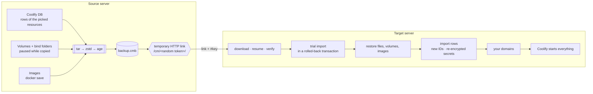

<p align="center">
  
</p>

<p align="center">
  <a href="https://github.com/mtalavi/coolify-mirror/releases/latest"></a>
  <a href="https://github.com/mtalavi/coolify-mirror/actions/workflows/ci.yml"></a>
  
  
  
  <a href="LICENSE"></a>
</p>

<p align="center">
  <b>Back up one domain, a few, or a whole Coolify server — then restore it on another Coolify with a single pasted link.</b><br>
  Projects, environments, env vars, secrets, volumes, files, images and proxy settings arrive intact and start through Coolify itself.
</p>

<p align="center">
  <a href="#-install">Install</a> ·
  <a href="#-walkthrough">Walkthrough</a> ·
  <a href="#-how-it-works">How it works</a> ·
  <a href="#-command-line">CLI</a> ·
  <a href="#-safety">Safety</a> ·
  <a href="#-limitations">Limitations</a> ·
  <a href="README.fa.md">فارسی</a>
</p>

---

## ✨ Why

Coolify's own backup covers its database. Moving **one app** to a new server — with its database data, volumes, env vars, domains and the exact built image — is a manual afternoon. Coolify Mirror makes it one menu:

| | |
|---|---|
| 🎯 **Pick by domain** | Arrow keys + space. Databases and services an app depends on (via `DATABASE_URL`, etc.) are found and added for you. |
| 🔒 **Encrypted end to end** | The backup file is encrypted with [age](https://age-encryption.org) (scrypt passphrase). The key travels only in the link's `#fragment`. |
| 🔗 **One link transfer** | The source serves the file over a temporary, random-token URL — through Coolify's own proxy on port 80, or a direct port. |
| ⚡ **No rebuild** | The exact image your app runs is shipped, so Coolify on the target logs *“Build step skipped”* and starts the same commit. |
| 🌐 **Domains last** | Right before anything starts you can keep or change every domain. |
| ♻️ **Rollback** | Every restore is trial-run in a rolled-back transaction first; a failure in the middle puts the target back the way it was. |

---

## 🚀 Install

On **each** Coolify server (as root):

```bash
curl -fsSL https://raw.githubusercontent.com/mtalavi/coolify-mirror/main/install.sh | sudo sh
```

The installer picks `amd64`/`arm64`, downloads the [latest release](https://github.com/mtalavi/coolify-mirror/releases/latest), verifies its SHA-256 and installs `/usr/local/bin/coolify-mirror`. Pin a version with `… | sudo VERSION=v1.1.0 sh`.

Then just run:

```bash
sudo coolify-mirror
```

> [!TIP]
> The target server doesn't even need the installer: after a backup, the source prints a one-line `curl … | sha256sum -c` command that downloads the tool **from the source server itself**.

<details>
<summary><b>Build from source</b></summary>

```bash
git clone https://github.com/mtalavi/coolify-mirror && cd coolify-mirror
scripts/build.sh            # → dist/coolify-mirror-linux-{amd64,arm64} + SHA256SUMS
scp dist/coolify-mirror-linux-amd64 root@SERVER:/usr/local/bin/coolify-mirror
```
Needs Go 1.26+. The binaries are static (no CGO) and have no runtime dependencies besides Docker and Coolify on the server.
</details>

---

## 🎬 Walkthrough

Real screenshots from two Coolify 4.3.23 servers (IP addresses replaced with documentation ranges).

### On the source server

**1 · Start** — the tool checks Docker, Coolify and its version.


**2 · Pick what to move** — every resource with its domain, type, project and state. `space` selects, `/` filters, `ctrl+a` selects all.


**3 · Dependencies** — the Postgres that `shop-web` uses through `DATABASE_URL` is suggested automatically.


**4 · Options** — how to keep running databases consistent while their data is copied, and which Docker images to include.


| Consistency | What happens |
|---|---|
| **Pause** *(default)* | Containers using a volume are paused for the seconds it takes to copy it. |
| **Stop** | Stopped and started again — safest, a short downtime. |
| **Live** | Nothing is touched; databases may be copied mid-write. |

| Images | What happens on the new server |
|---|---|
| **Application images** *(default)* | Apps built by Coolify start from the shipped image — no rebuild. Public images (postgres, wordpress…) are pulled. |
| **All images** | Everything is in the file — works without internet / Docker Hub. Bigger file. |
| **No images** | Smallest file; Coolify pulls everything and **rebuilds** apps from Git. |

**5 · Live progress** — every step with ✓ / ✗, bytes, speed and ETA.


**6 · Share** — a link appears. Paste it on the other server.


### On the target server

**7 · Paste the link** — choose *Restore a backup*.


**8 · Verify** — the file is downloaded (resumable), decrypted and every checksum verified **before** anything changes.


**9 · Review** — conflicts, existing volumes, shared host folders and domain clashes are listed. Nothing has changed yet.


**10 · Domains, last** — keep or change every domain. Comma-separate several; empty removes it.


**11 · Running** — Coolify itself starts databases, then services, then apps, and the tool waits until they are healthy.


Refresh Coolify — the project is there with all its environments, variables, storages, tags, scheduled tasks and backups.

---

## 🧠 How it works



**Selective backup** (one or more resources) exports their rows from Coolify's Postgres — application, service, database, environment variables, storages, tags, scheduled tasks, backup schedules, S3, keys, GitHub App, deployment snapshot — plus their volumes, file mounts and images. On restore, every row gets a fresh ID, every encrypted value (env vars, passwords, keys) is decrypted with the source key and re-encrypted with the target's `APP_KEY`, and the import runs in **one transaction**.

**Full backup** takes the whole Coolify: database dump, `.env` (including `APP_KEY`), SSH keys, proxy config and certificates, and every resource's data. A full restore replaces the target Coolify after making a safety copy, and rolls back on any error.

| | Selective | Full |
|---|---|---|
| Use it for | moving / cloning projects | moving a whole server |
| Target Coolify | any — existing resources are kept | replaced (safety copy first) |
| Logins | target's users | source's users, API tokens, settings |
| Same resource already there | restore as copy, or skip | — |

---

## ⌨️ Command line

Everything in the menu also works headless, for scripts:

```bash
coolify-mirror list                                     # resources and domains
coolify-mirror backup --domain shop.com,blog.com        # selective (+ dependencies)
coolify-mirror backup --all                             # every resource
coolify-mirror backup --full                            # the whole Coolify
coolify-mirror backup --domain shop.com --serve --mode proxy
coolify-mirror serve FILE.cmb --detach                  # share for 24 h in the background
coolify-mirror restore 'http://…/backup.cmb#key=…'
coolify-mirror restore FILE.cmb --key KEY --yes \
  --set-domain shop.com=shop.new.com --set-domain www.shop.com=-
coolify-mirror start-all                                # ask Coolify to start anything stopped
```

<details>
<summary><b>All flags</b></summary>

| Command | Flag | Meaning |
|---|---|---|
| `backup` | `--domain a,b` / `--uuid u` / `--all` / `--full` | what to back up |
| | `--no-deps` | don't add databases/services the apps depend on |
| | `--consistency pause\|stop\|live` | see the table above |
| | `--images apps\|all\|none` | see the table above |
| | `--include-backups` | full: also `/data/coolify/backups` |
| | `--output DIR` | default `/data/coolify-mirror/backups` |
| | `--serve --mode proxy\|direct --port 8123 --host IP --open-firewall` | share right after |
| `serve` | `--key`, `--mode`, `--port`, `--host`, `--open-firewall`, `--detach`, `--ttl 24h` | share an existing file |
| `restore` | `--key KEY` | when the link has no `#key=` |
| | `--yes` | no questions |
| | `--on-conflict copy\|skip` | resource already exists here |
| | `--team ID` | target team (selective) |
| | `--set-domain OLD=NEW` | change a domain; `NEW` = `-` removes it (repeatable) |
| | `--no-start` | restore but don't start |
| | `--keep-download` | keep the downloaded file |
</details>

---

## 🛡️ Safety

- **Encryption.** Backups are `age`-encrypted with a random 26-character key. Without the key the file is useless; the tool never writes the key into the URL path or logs.
- **Temporary links.** Shares use a random 128-bit token path and stop when you quit (or after `--ttl`). The tool binary offered for download is checksum-verified on the target.
- **One run at a time.** A lock prevents two backups/restores on a server. Paused containers are always resumed — even after `Ctrl+C` or a crash (next run recovers them).
- **Nothing is deleted.** Volumes that already exist on the target keep their old data in `<name>.cm-old-<time>`; replaced folders go to `/data/coolify-mirror/replaced-<time>`.
- **Rollback.** Selective: everything created is removed if the import fails. Full: the previous Coolify database and `.env` are restored and its containers started again.
- **Logs** of every run: `/data/coolify-mirror/logs/`.

> [!IMPORTANT]
> Run it inside `tmux`/`screen` on big servers so an SSH disconnect doesn't interrupt a long copy.

---

## ⚠️ Limitations

- Coolify **v4.3.x**; the target must run the **same or a newer** version (enforced for full restores).
- Resources running on **remote servers**, **preview deployments** and **Swarm** are not part of a selective backup.
- **GitHub webhooks**, **DNS** and **scheduled tasks/backups** still point to / run on the old server — switch them when you move.
- Different CPU architecture (amd64 → arm64): shipped images can't be used, Coolify rebuilds.

---

## 🧪 Tested

On real Coolify 4.3.23 installs (lab in [`lab/`](lab)): Postgres/MariaDB/Redis data, WordPress, compose apps, Git apps without rebuild, copies next to originals, restore into a fresh never-used Coolify, full server restore with rollback (fault injection), interrupted backups, domain changes at the end, plus unit tests for Laravel encryption, the archive format, the import planner and resumable downloads.

---

## 🧩 Project layout

```
cmd/coolify-mirror     CLI + entry point
internal/ui            interactive menu (Bubble Tea, huh, lipgloss)
internal/engine        backup, share, fetch, selective/full restore, start, domains
internal/dbx           export + import planner for Coolify's database
internal/coolify       Coolify detection, psql, PHP runner, Laravel encryption
internal/archive       tar + zstd + age stream format
internal/transfer      share server + resumable download
lab/                   Docker lab with real Coolify servers
```

Contributions and issues are welcome. **Not affiliated with Coolify / coolLabs** — “Coolify” is their trademark.

## 📄 License

[MIT](LICENSE)
